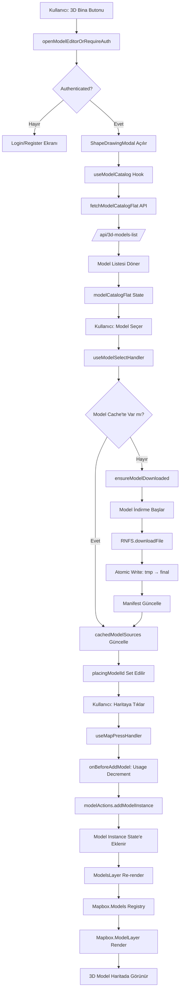

# 3D Model Editöre Model Ekleme Süreci - Detaylı Dokümantasyon

## Genel Bakış

Mobil uygulamada 3D model editörüne model ekleme süreci şu adımlardan oluşur:

1. **Model Editörü Açılması** → `ShapeDrawingModal` açılır
2. **Model Kataloğu Yüklenmesi** → Backend'den model listesi çekilir
3. **Model Seçimi** → Kullanıcı dropdown'dan model seçer
4. **Model İndirme/Cache** → Model telefona indirilir veya cache'ten alınır
5. **Model Yerleştirme** → Kullanıcı haritaya tıklayarak modeli yerleştirir
6. **Model Render** → Mapbox ModelLayer ile 3D model haritada görüntülenir

---

## 1. Model Editörü Açılması

### Dosya: `frontend/screens/routes/index.tsx`

**Fonksiyon:** `openModelEditorOrRequireAuth()`

```typescript
// Satır 304-330
const openModelEditorOrRequireAuth = useCallback(() => {
  if (isAuthenticated) {
    setShapeDrawingModalVisible(true);  // ✅ Model editörü açılır
    return;
  }
  // Giriş yapılmamışsa login/register ekranına yönlendir
  Alert.alert('Giriş gerekli', ...);
}, [isAuthenticated, router]);
```

**Tetiklendiği Yerler:**
- Ana ekranda "3D Bina" butonu (satır 2374)
- Hamburger menüden "3D Bina" seçeneği (satır 338)

**Önemli Not:** Model editörü kullanmak için **authentication gerekli**.

---

## 2. Model Kataloğu Yüklenmesi

### Dosya: `frontend/components/app/shapeDrawingModal/useModelCatalog.ts`

**Hook:** `useModelCatalog(visible: boolean)`

### Süreç:

#### 2.1. Backend API Çağrısı
- **Endpoint:** `/api/3d-models-list/`
- **Method:** GET
- **Auth:** Bearer token (varsa)
- **Dosya:** `frontend/src/maps/models/modelCatalog.ts`

```typescript
// Satır 233-360
export async function fetchModelCatalogFlat(): Promise<ModelCatalogFlatItem[]>
```

**API Response Formatı:**
```json
{
  "car": [
    {
      "id": 8,
      "file": "model_8.glb",
      "path": "models/car/model_8.glb",
      "name": "Araba Modeli",
      "remaining_uses": 10,
      "is_available": true,
      "is_owned": true,
      "tepe_credits": 5
    }
  ],
  "house": [...],
  "tree": [...],
  "grass": [...]
}
```

#### 2.2. Model Listesi İşleme
- Her model için `modelId` DB tabanlı oluşturulur: `model_<id>` (örn: `model_8`)
- `source` URL'i oluşturulur: `${baseUrl}/static/${path}`
- Kategorilere göre gruplandırılır: `car`, `house`, `tree`, `grass`

#### 2.3. Cache Kontrolü
- Daha önce indirilen modeller kalıcı store’dan kontrol edilir (`pp_models_store_v1`)
- Cihazda varsa `cachedModelSources` state'ine eklenir (modelId → `file://` URI)

**Önemli State'ler:**
- `modelCatalogFlat`: Tüm modellerin düz listesi
- `cachedModelSources`: Cache'teki modeller (modelId → file:// URI)
- `modelsProp`: Mapbox'a verilecek format (modelId → **string uri/url**)

---

## 3. Model Seçimi

### Dosya: `frontend/components/app/shapeDrawingModal/useModelSelectHandler.ts`

**Hook:** `useModelSelectHandler(args)`

### Süreç:

#### 3.1. Kullanıcı Dropdown'dan Model Seçer
- **UI:** `ShapeDrawingDropdownSheets` component'i
- **Dosya:** `frontend/components/app/shapeDrawingModal/ShapeDrawingDropdownSheets.tsx`

#### 3.2. Model Seçim Handler Çağrılır
```typescript
// Satır 50-222
async (m: ModelCatalogFlatItem) => {
  // 1. Kullanım hakkı kontrolü
  if (!isModelUsable(remainingUses)) {
    Alert.alert("Kullanım Hakkı Tükenmiş", ...);
    return;
  }
  
  // 2. Model URL'i al
  let src = modelsProp?.[m.modelId];
  
  // 3. Model indirme (kalıcı store)
  // - DB id zorunlu: dosya adı model_<id>.glb
  const fileUri = await ensureModelDownloaded(m.modelId, src, m.id);
  setCachedModelSources((prev) => ({ ...prev, [m.modelId]: fileUri }));
  
  // 4. Yerleştirme modunu aktif et
  setPlacingModelId(m.modelId); // artık "model_<id>"
}
```

**Önemli Notlar:**
- Model seçildiğinde **indirme hemen başlar** (kalıcı store’a yazılır) ve sonra `placingModelId` set edilir.
- Dosya adı standardı: `model_<id>.glb` (API response `id` alanı).

---

## 4. Model İndirme (Kalıcı Store)

### Dosya: `frontend/src/utils/modelStore.ts`

**Fonksiyon:** `ensureModelDownloaded(modelKey, url, id)`

### Süreç:

#### 4.1. Kalıcı dizin
- `DocumentDirectoryPath/pp_models_store_v1/`

#### 4.2. Dosya adı standardı (DB)
- `model_<id>.glb` (örn: `model_8.glb`)

#### 4.3. Atomik indirme + doğrulama
- `.tmp` dosyaya indir\n- `MIN_BYTES` ile size doğrula\n- `moveFile(tmp, final)` ile finalize et\n- `file:///...` normalize et\n- AsyncStorage index güncelle

#### 4.4. Atomic Write
```typescript
// Satır 755-803
// 1. Eski final dosyayı sil
await RNFS.unlink(localPath);

// 2. Tmp'den final'e taşı (atomic move)
await RNFS.moveFile(tmpPath, localPath);

// 3. Final dosya doğrulama
const finalStat = await RNFS.stat(localPath);
```

#### 4.5. Store Index Güncelleme (AsyncStorage)

- İndirme sonrası dosya doğrulandıktan sonra index güncellenir.\n- Index anahtarı: `pp_models_index_v1`\n- Key: `model_<id>` (örn: `model_8`)\n- Dosya adı: `model_<id>.glb` (örn: `model_8.glb`)\n- Klasör: `pp_models_store_v1`

---

## 5. Model Yerleştirme

### Dosya: `frontend/components/app/shapeDrawingModal/useMapPressHandler.ts`

**Hook:** `useMapPressHandler(args)`

### Süreç:

#### 5.1. Haritaya Tıklama
```typescript
// Satır 77-216
return useCallback((e: any) => {
  // 1. Koordinat normalizasyonu
  let c: [number, number] | null = normalizeLngLat(e?.geometry?.coordinates);
  
  // 2. Model yerleştirme modu kontrolü
  if (placingModelId) {
    // 3. Kullanım hakkı kontrolü ve decrement
    if (getModelIdFromStringId && onBeforeAddModel) {
      const modelId = getModelIdFromStringId(placingModelId);
      if (modelId !== undefined) {
        const result = await onBeforeAddModel(modelId);
        if (!result.success) {
          Alert.alert("Kullanım hakkı tükenmiş");
          return;
        }
      }
    }
    
    // 4. Model instance ekle
    modelActions.addModelInstance(c, placingModelId);
    
    // 5. Yerleştirme modunu kapat (opsiyonel)
    // modelActions.setPlacingModelId(null);
  }
}, [placingModelId, modelActions, ...]);
```

#### 5.2. Model Instance Oluşturma
**Dosya:** `frontend/src/maps/models/ModelManager.ts`

```typescript
// ModelManager hook'u
const [modelState, modelActions] = useModelManager();

// addModelInstance fonksiyonu
addModelInstance: (coordinate: [number, number], modelId: string) => {
  const instance = {
    id: `model-${Date.now()}-${Math.random()}`,
    modelId,
    coordinate,
    modelScale: [1, 1, 1],
    modelRotation: [0, 0, 0],
    modelTranslation: [0, 0, 0],
    modelOpacity: 1.0,
  };
  setInstances((prev) => [...prev, instance]);
}
```

**Önemli Notlar:**
- Model yerleştirildiğinde **kullanım hakkı decrement edilir** (API çağrısı)
- Her instance **unique ID** alır
- Model **hemen render edilir** (ModelsLayer component'i)

---

## 6. Model Render

### Dosya: `frontend/src/maps/models/ModelsLayer.tsx`

**Component:** `ModelsLayer`

### Süreç:

#### 6.1. Models Registry (string mapping)
```typescript
// ShapeDrawingModal.tsx - Satır 272
const { modelsProp } = useModelCatalog(visible);

// Format: { [modelId]: string | number }
// Örnek: { "model_8": "file:///data/.../pp_models_store_v1/model_8.glb" }
```

#### 6.2. Mapbox Models Component
```typescript
// ModelsLayer.tsx - Satır 248-266
<Mapbox.Models models={modelsProp}>
  {/* ModelLayer'lar burada render edilir */}
</Mapbox.Models>
```

**Önemli:** `Models` component'i **tüm modelleri** bir kere register eder. Her model için ayrı `Models` component'i **gerekmez**.

#### 6.3. ModelLayer Render
```typescript
// ModelsLayer.tsx - Satır 267-387
// Her modelId için ayrı ModelLayer oluşturulur
{Object.entries(modelGroups).map(([modelId, instances]) => (
  <React.Fragment key={`models-group-${modelId}`}>
    <Mapbox.ShapeSource id={`models-source-${modelId}`} shape={modelShape}>
      <Mapbox.ModelLayer
        id={`models-layer-${modelId}`}
        sourceID={`models-source-${modelId}`}
        style={{
          modelId: modelId,  // ✅ Registry key ile eşleşmeli
          modelScale: instances[0].modelScale,
          modelRotation: instances[0].modelRotation,
          modelTranslation: instances[0].modelTranslation,
          modelOpacity: instances[0].modelOpacity,
        }}
      />
    </Mapbox.ShapeSource>
  </React.Fragment>
))}
```

**Kritik Noktalar:**
- `Models` registry'deki key ile `ModelLayer` style'daki `modelId` **aynı olmalı**
- Her modelId için **bir ShapeSource + bir ModelLayer** oluşturulur
- Tüm instance'lar **aynı modelId için** aynı ModelLayer'da render edilir

---

## Veri Akışı Diyagramı



---

## Önemli Dosyalar ve Sorumlulukları

| Dosya | Sorumluluk |
|-------|------------|
| `index.tsx` | Model editörü açma, authentication kontrolü |
| `ShapeDrawingModal.tsx` | Ana modal component, state yönetimi |
| `useModelCatalog.ts` | Model kataloğu yükleme, cache kontrolü |
| `modelCatalog.ts` | Backend API çağrısı, model listesi işleme |
| `useModelSelectHandler.ts` | Model seçim handler, indirme tetikleme |
| `modelStore.ts` | Model indirme, kalıcı store (`pp_models_store_v1`), `model_<id>.glb` standardı |
| `useMapPressHandler.ts` | Harita tıklama, model yerleştirme |
| `ModelManager.ts` | Model instance yönetimi (add/remove/update) |
| `ModelsLayer.tsx` | Mapbox ModelLayer render, registry yönetimi |

---

## Cache Stratejisi Detayları

### Dosya İsimlendirme
- **Tek standart:** `model_<id>.glb` (DB `id`, unique)

### Index Yapısı (AsyncStorage)
```json
{
  "model_8": {
    "id": 8,
    "url": "https://.../static/models/tree/model_8.glb",
    "fileUri": "file:///data/user/0/<package>/files/pp_models_store_v1/model_8.glb",
    "bytes": 1234567,
    "updatedAt": 1706284800000
  }
}
```

### Kalıcı Store Dizini
- **Android:** `/data/user/0/<package>/files/pp_models_store_v1/`
- **iOS:** `<AppSandbox>/Documents/pp_models_store_v1/`

---

## Hata Senaryoları ve Çözümleri

### 1. Model Görünmüyor
**Olası Nedenler:**
- `Models` registry'de key yok
- `ModelLayer` style'daki `modelId` registry key ile eşleşmiyor
- Model dosyası bozuk/yarım
- Terrain/pitch ayarları yanlış

**Çözüm:**
- Console log'ları kontrol et (`[ModelsLayer]`, `[useModelCatalog]`)
- Cache'i temizle ve yeniden indir
- Model dosyasını manuel kontrol et

### 2. Model İndirme Başarısız
**Olası Nedenler:**
- Network timeout
- Backend URL erişilemiyor
- Dosya boyutu çok büyük
- Disk alanı yetersiz

**Çözüm:**
- Timeout süresini artır (varsayılan: 5 dakika)
- Retry mekanizması çalışıyor (3 deneme)
- Disk alanını kontrol et

### 3. Cache Sorunları
**Olası Nedenler:**
- Manifest corrupt
- Dosya adı değişti
- URL hash değişti

**Çözüm:**
- `clearAllCachedModels()` fonksiyonunu çağır
- Cache dizinini manuel temizle
- Yeniden indirme yap

---

## Test Senaryoları

### 1. İlk Model Ekleme
1. Model editörü aç
2. Model seç
3. İndirme progress'i gözle
4. Haritaya tıkla
5. Model görünmeli

### 2. Cache'ten Model Ekleme
1. Daha önce indirilmiş model seç
2. İndirme **olmamalı** (cache'ten alınmalı)
3. Haritaya tıkla
4. Model **hemen** görünmeli

### 3. Kullanım Hakkı Kontrolü
1. Kullanım hakkı tükenmiş model seç
2. Alert gösterilmeli
3. Model seçilememeli

### 4. Çoklu Model Yerleştirme
1. Bir model seç
2. Haritaya birden fazla yere tıkla
3. Her tıklamada yeni instance oluşmalı
4. Tüm instance'lar görünmeli

---

## Performans Optimizasyonları

1. **Lazy Loading:** Model seçildiğinde değil, yerleştirildiğinde indirilir
2. **Cache:** İndirilen modeller cache'te saklanır, tekrar indirme yapılmaz
3. **Atomic Write:** Yarım dosya riski minimize edilir
4. **Manifest:** Dosya doğrulama için manifest kullanılır
5. **Progress Callback:** Kullanıcıya indirme progress'i gösterilir

---

## Sonuç

3D model editöre model ekleme süreci **6 ana adımdan** oluşur:
1. Model editörü açılması
2. Model kataloğu yüklenmesi
3. Model seçimi
4. Model indirme/cache
5. Model yerleştirme
6. Model render

Her adım **detaylı loglama** ve **hata yönetimi** ile desteklenir. Cache stratejisi **model_id (DB unique ID)** bazlıdır ve **atomic write** ile güvenli dosya yazma sağlanır.
