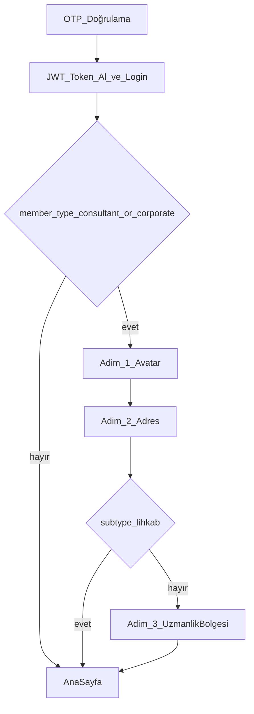

# Kayıt Tamamlama (Danışman / Kurumsal) – Mobil

Bu doküman, OTP ile kayıt sonrası **Danışman** ve **Kurumsal** kullanıcılar için çalışan tamamlayıcı onboarding akışını açıklar.
Kurumsal kapsama `Emlak Firması`, `SPK Lisanslı Değerleme Firması` ve `Lihkab Büro` alt tipleri dahildir.
Danışman kapsama `Emlak`, `SPK` ve `Lihkab` alt tipleri dahildir.

## Amaç

- Danışman/Kurumsal kullanıcılar için kayıt sonrası eksik alanları toplamak:
  - Profil fotoğrafı (opsiyonel – admin onayı sürecine gider)
  - Adres (zorunlu)
  - Uzmanlık Bölgeleri (zorunlu, max 5 mahalle)
- İstisna:
  - `Lihkab Büro` ve `Lihkab Danışmanı` için uzmanlık bölgesi adımı gösterilmez
  - Bu iki akışta onboarding `avatar -> address -> index` olarak tamamlanır

## Ekran ve Dosyalar

- **Onboarding ekranı**: `frontend/screens/routes/complete-registration.tsx`
- **Adres seçimi (reuse edilen modal)**: `frontend/components/app/AddressPickerModal.tsx`
- **Kayıt ekranı yönlendirme**: `frontend/screens/routes/(auth)/register.tsx`
- **API servisleri**: `frontend/services/authService.ts`

## Akış

## Adım 1 – Profil Fotoğrafı

- Fotoğraf seçimi: `react-native-image-picker` ile galeri
- Yükleme: `authService.uploadAvatar(uri, { remove_background })`
- Not: Avatar yükleme endpoint’i token gerektirir (OTP sonrası login yapıldığı için çalışır).

## Adım 2 – Adres (İl/İlçe/Mahalle)

- UI: `AddressPickerModal` kullanılır.
- Kaydedilen alanlar:
  - `city_id`, `city_name`
  - `district_id`, `district_name`
  - `quarter_id`, `quarter_name`
  - `quarter_value` (mahalle **Proparcel_value**, prime eşleşme için)
  - `street_and_number`
- API: `authService.updateProfile(...)` → `PUT /api/profile/`

## Adım 3 – Uzmanlık Bölgeleri (max 5)

- Seçim UI: İl → İlçe → Mahalle (adresle aynı dropdown/picker pattern)
- Davranış:
  - Mahalle seçilince chip listesine eklenir
  - Duplicate engeli: aynı `quarter_value` tekrar eklenemez
  - Max 5: 5/5 dolunca ekleme disable + kısa uyarı
  - Mahalle seçimi sonrası dropdown resetlenir
- API: `authService.updateExpertiseAreas([quarter_value...])` → `PUT /api/profile/expertise-areas/`

## Prime Bölge Kuralı (özet)

- Prime hesaplama backend’dedir.
- Eğer kullanıcının ikamet adresinde `quarter_value` doluysa ve uzmanlık listesinde aynı `quarter_value` varsa:
  - eşleşen satır `is_prime=true`
  - diğerleri `is_prime=false`
- Eğer ikamet mahallesi seçilmediyse (`quarter_value` null):
  - prime belirlenmez (`is_prime=false`)

