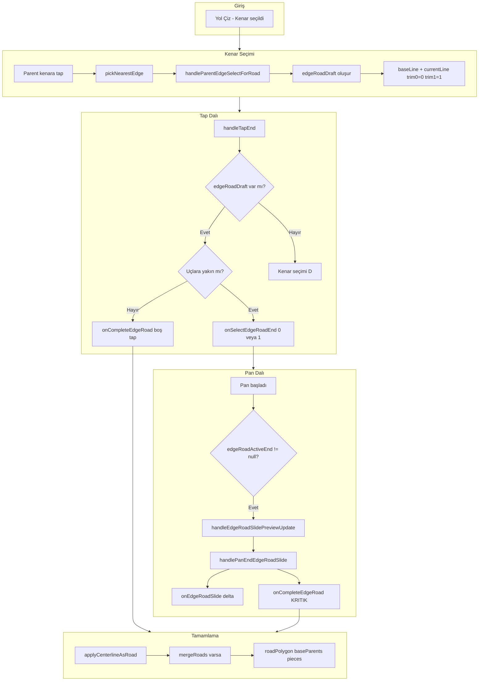
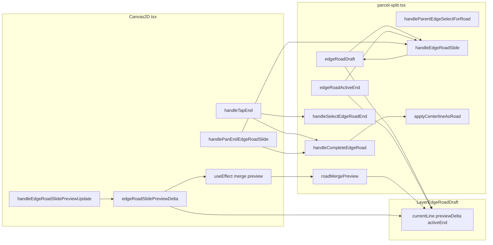

# Kenar Yol Çizimi – Tam Özellik Tanımı ve Kod Dokümanı

Bu doküman, ProParcel Hisseli Parsel ekranında **Yol Çiz / Kenar** modunun hedeflerini, iş akışını, ilgili tüm kodu ve bağlantı şemalarını içerir. Başka bir yapay zekâ tarafından geliştirme yapılırken referans olarak kullanılabilir.

---

## 1. ANA AMAÇ

**Seçilen kenara sıfır paralel yol oluşturmak.**

Kenar modunda kullanıcı:
- Parsel sınırındaki bir kenarı seçer
- Bu kenara paralel (polygon içine doğru offsetli) bir şablon yol çizgisi görür
- Bu şablon üzerinden yolun uzunluğunu ayarlayabilir veya doğrudan tamamlayabilir
- Yol tamamlandığında parsel hesapları yeniden yapılır

---

## 2. HEDEF DAVRANIŞLAR (Detaylı)

### 2.1 Kenar Seçimi
- **Yol Çiz** → **Kenar** seçildiğinde mod aktif olur
- Kullanıcı parsell sınırındaki bir **kenara tıklar**
- Kenar seçilince: **Hiçbir yol oluşturulmaz**. Sadece seçilen kenar üzerinde paralel bir **şablon çizgi** (draft) görünür
- Şablon çizgi, kenarın tamamı boyunca (baseLine) gösterilir

### 2.2 Boş Alana Tıklama = Yol Tamamlama
- Şablon çizgi varken kullanıcı **boş bir yere** tıklarsa:
  - Yol **şablonun mevcut uzunluğunda** oluşturulur
  - Parseller **yeniden hesaplanır** (baseParentsRings, pieces, splitLines)
  - Şablon ve seçim temizlenir, mod kapanır

### 2.3 Uç Seçimi ve Boyutlandırma
- Şablon çizginin **iki ucu** (currentLine[0] ve currentLine[1]) handle gibi seçilebilir
- Kullanıcı bir **uca tıklar** → o uç seçilir (görsel olarak vurgulanır)
- **Sadece seçili uç** sürüklenebilir; **diğer uç sabit kalır**
- Sürükleme ile yolun **boyu uzatılır veya kısaltılır** (kenar boyunca, teğet yönünde)
- Bırakıldığında şablon **o uzunlukta kalır**

### 2.4 Pan Bırakma = Yol Tamamlama
- Uç sürüklenip **bırakıldığında**:
  - Şablon o anki uzunlukta **kalır**
  - Yol **hemen tamamlanır** (applyCenterlineAsRoad)
  - Parseller yeniden hesaplanır
  - Tamamlama butonuna basmaya gerek yok

### 2.5 Merge (Başka Yola Yaklaşma)
- Sürüklenen uç **başka bir yola** (mevcut roadCenterline) yaklaşırsa:
  - O yol üzerinde **kesişim (merge) noktası** (cyan halka) belirir
  - Kullanıcı parmağını **merge noktasına getirip bırakırsa**: iki yol **kesiştirilir/birleştirilir**
  - mergeRoads + applyCenterlineAsRoad ile tek roadCenterline oluşur

---

## 3. İŞ AKIŞI DİYAGRAMI



---

## 4. VERİ AKIŞI ŞEMASI



---

## 5. DOSYA YAPISI VE SORUMLULUKLAR

| Dosya | Sorumluluk |
|-------|------------|
| `parcel-split.tsx` | State (edgeRoadDraft, edgeRoadActiveEnd, roadMergePreview), handler'lar, applyCenterlineAsRoad |
| `Canvas2D.tsx` | Tap/Pan gesture, koordinat dönüşümü, merge preview hesabı |
| `LayerEdgeRoadDraft.tsx` | Şablon çizgi ve uç handle'larının SVG render |
| `LayerParentEdgePick.tsx` | Kenar seçiminde parent kenarların vurgulanması |
| `EdgeRoadModeBar.tsx` | Tamamla / İptal butonları |
| `roadGeometry.ts` | createEdgeParallelBaseLine, createEdgeParallelCenterline |
| `roadMerge.ts` | computeMergeCandidate, mergeRoads, RoadMergePreview |
| `parcelSplit.ts` (types) | EdgeRoadDraft, RoadDrawSubMode |

---

## 6. TÜM İLGİLİ KODLAR

### 6.1 Tipler (parcelSplit.ts)

```typescript
export type RoadDrawSubMode = "none" | "vertical" | "horizontal" | "edge" | "freehand";

export type EdgeRoadDraft = {
  edgeIndex: number;
  baseLine: [Point, Point];   // Kenar boyunca tam paralel çizgi
  trim0: number;              // 0..1, sol uç parametresi
  trim1: number;              // 0..1, sağ uç parametresi
  currentLine: [Point, Point]; // Kesilmiş çizgi: lerp(baseLine, trim0), lerp(baseLine, trim1)
};
```

### 6.2 State (parcel-split.tsx)

```typescript
const [selectedParentEdgeForRoad, setSelectedParentEdgeForRoad] = useState<number | null>(null);
const [edgeRoadDraft, setEdgeRoadDraft] = useState<EdgeRoadDraft | null>(null);
const [edgeRoadActiveEnd, setEdgeRoadActiveEnd] = useState<0 | 1 | null>(null);
const [roadMergePreview, setRoadMergePreview] = useState<RoadMergePreview | null>(null);
```

### 6.3 handleParentEdgeSelectForRoad (parcel-split.tsx, satır 888-915)

```typescript
const handleParentEdgeSelectForRoad = useCallback(
  (edgeIndex: number | null) => {
    if (edgeIndex == null) {
      setSelectedParentEdgeForRoad(null);
      setEdgeRoadDraft(null);
      setEdgeRoadActiveEnd(null);
      return;
    }
    setSelectedParentEdgeForRoad(edgeIndex);
    if (!ring || ring.length < 3) return;
    let W = parseFloat(roadWidthInput);
    if (!Number.isFinite(W) || W <= 0) W = 2;
    W = Math.max(0.5, Math.min(30, W));
    const offsetMeters = W / 2;
    const baseLine = createEdgeParallelBaseLine(ring, edgeIndex, offsetMeters);
    if (!baseLine) return;
    const [p1, p2] = baseLine;
    setEdgeRoadDraft({
      edgeIndex,
      baseLine,
      trim0: 0,
      trim1: 1,
      currentLine: [p1, p2],
    });
    setEdgeRoadActiveEnd(null);
  },
  [ring, roadWidthInput]
);
```

### 6.4 handleSelectEdgeRoadEnd (parcel-split.tsx, satır 917-919)

```typescript
const handleSelectEdgeRoadEnd = useCallback((endIndex: 0 | 1) => {
  setEdgeRoadActiveEnd(endIndex);
}, []);
```

### 6.5 handleEdgeRoadSlide (parcel-split.tsx, satır 921-945)

Sadece seçili ucu hareket ettirir; diğer uç sabit.

```typescript
const handleEdgeRoadSlide = useCallback(
  (deltaMeters: number) => {
    if (!edgeRoadDraft || edgeRoadActiveEnd == null) return;
    const [p1, p2] = edgeRoadDraft.baseLine;
    const baseLen = Math.hypot(p2.x - p1.x, p2.y - p1.y) || 1;
    const minGap = Math.max(0.02, 2 / baseLen);
    const dt = Math.max(-0.25, Math.min(0.25, deltaMeters / baseLen));
    let trim0 = edgeRoadDraft.trim0;
    let trim1 = edgeRoadDraft.trim1;
    if (edgeRoadActiveEnd === 0) {
      trim0 = Math.max(0, Math.min(trim0 + dt, trim1 - minGap));
    } else {
      trim1 = Math.min(1, Math.max(trim1 + dt, trim0 + minGap));
    }
    const newP1 = { x: p1.x + trim0 * (p2.x - p1.x), y: p1.y + trim0 * (p2.y - p1.y) };
    const newP2 = { x: p1.x + trim1 * (p2.x - p1.x), y: p1.y + trim1 * (p2.y - p1.y) };
    setEdgeRoadDraft({
      ...edgeRoadDraft,
      trim0,
      trim1,
      currentLine: [newP1, newP2],
    });
  },
  [edgeRoadDraft, edgeRoadActiveEnd]
);
```

### 6.6 handleCompleteEdgeRoad (parcel-split.tsx, satır 947-963)

```typescript
const handleCompleteEdgeRoad = useCallback(() => {
  if (!edgeRoadDraft || !ring || ring.length < 3) return;
  const MERGE_TOL = 1.5;
  let centerline = [...edgeRoadDraft.currentLine];
  if (roadMergePreview && roadMergePreview.distance < MERGE_TOL && roadCenterline && roadCenterline.length >= 2) {
    const merged = mergeRoads(centerline, roadCenterline, roadMergePreview, ring);
    if (merged.length >= 2) centerline = merged;
  }
  if (centerline.length >= 2) {
    applyCenterlineAsRoad(centerline);
    setEdgeRoadDraft(null);
    setEdgeRoadActiveEnd(null);
    setSelectedParentEdgeForRoad(null);
    setRoadDrawSubMode("none");
    setRoadMergePreview(null);
  }
}, [edgeRoadDraft, ring, roadMergePreview, roadCenterline, applyCenterlineAsRoad]);
```

### 6.7 handleTapEnd – Edge Road Dalı (Canvas2D.tsx, satır 311-332)

```typescript
if (roadDrawSubMode === "edge" && edgeRoadDraft && onSelectEdgeRoadEnd && onCompleteEdgeRoad) {
  const tolW = TAP_TOLERANCE_PX / scale;
  const endTol = Math.max(1.2, tolW * 2);
  const [ep0, ep1] = edgeRoadDraft.currentLine;
  const d0 = Math.hypot(pw.x - ep0.x, pw.y - ep0.y);
  const d1 = Math.hypot(pw.x - ep1.x, pw.y - ep1.y);
  if (d0 < endTol || d1 < endTol) {
    onSelectEdgeRoadEnd(d0 < d1 ? 0 : 1);
    return;
  }
  onCompleteEdgeRoad();  // Boş tap = tamamla
  return;
}
if (roadDrawSubMode === "edge" && edges.length && onSelectParentEdgeForRoad) {
  const tolW = TAP_TOLERANCE_PX / scale;
  const picked = pickNearestEdge(pw, edges, Math.max(tolW * 2, 8));
  if (picked != null) {
    const idx = parseInt(picked, 10);
    onSelectParentEdgeForRoad(Number.isNaN(idx) ? null : idx);
  }
  return;
}
```

### 6.8 handleEdgeRoadSlidePreviewUpdate (Canvas2D.tsx, satır 661-677)

Teğet yönünde delta hesaplar. NOT: activeEnd kullanılmıyor; preview simetrik.

```typescript
const handleEdgeRoadSlidePreviewUpdate = useCallback(
  (translationX: number, translationY: number) => {
    if (!edgeRoadDraft) return;
    const scale = viewTransform.scale;
    const [p1, p2] = edgeRoadDraft.baseLine;
    const dx = p2.x - p1.x;
    const dy = p2.y - p1.y;
    const len = Math.hypot(dx, dy) || 1;
    const tx = dx / len;
    const ty = dy / len;
    const worldDx = translationX / scale;
    const worldDy = translationY / scale;
    const deltaMeters = worldDx * tx + worldDy * ty;
    setEdgeRoadSlidePreviewDelta(deltaMeters);
  },
  [edgeRoadDraft, viewTransform.scale]
);
```

### 6.9 handlePanEndEdgeRoadSlide (Canvas2D.tsx, satır 679-696)

KRİTİK: Sadece onEdgeRoadSlide çağrılıyor; onCompleteEdgeRoad YOK.

```typescript
const handlePanEndEdgeRoadSlide = useCallback(
  (translationX: number, translationY: number) => {
    if (!edgeRoadDraft || !onEdgeRoadSlide) return;
    const scale = viewTransform.scale;
    const [p1, p2] = edgeRoadDraft.baseLine;
    const dx = p2.x - p1.x;
    const dy = p2.y - p1.y;
    const len = Math.hypot(dx, dy) || 1;
    const tx = dx / len;
    const ty = dy / len;
    const worldDx = translationX / scale;
    const worldDy = translationY / scale;
    const deltaMeters = worldDx * tx + worldDy * ty;
    onEdgeRoadSlide(deltaMeters);
    setEdgeRoadSlidePreviewDelta(0);
    // EKSIK: onCompleteEdgeRoad() cagrilmali
  },
  [edgeRoadDraft, viewTransform.scale, onEdgeRoadSlide]
);
```

### 6.10 Pan Gesture Koşulları (Canvas2D.tsx, satır 704-729)

```typescript
} else if (uiMode === "draw_road" && edgeRoadDraft != null && edgeRoadActiveEnd != null) {
  runOnJS(handleEdgeRoadSlidePreviewUpdate)(e.translationX, e.translationY);
}
// ...
} else if (uiMode === "draw_road" && edgeRoadDraft != null && edgeRoadActiveEnd != null) {
  runOnJS(handlePanEndEdgeRoadSlide)(e.translationX, e.translationY);
}
```

### 6.11 Merge Preview useEffect (Canvas2D.tsx, satır 602-635)

SORUN: effectiveP1/effectiveP2 simetrik hesaplanıyor (half = delta/2); activeEnd kullanılmıyor.

```typescript
useEffect(() => {
  if (!onMergePreviewChange || !edgeRoadDraft || uiMode !== "draw_road" || !ring || ring.length < 3) return;
  const [b1, b2] = edgeRoadDraft.baseLine;
  const [c1, c2] = edgeRoadDraft.currentLine;
  const dx = b2.x - b1.x;
  const dy = b2.y - b1.y;
  const baseLen = Math.hypot(dx, dy) || 1;
  const tx = dx / baseLen;
  const ty = dy / baseLen;
  const half = edgeRoadSlidePreviewDelta / 2;
  const effectiveP1 = { x: c1.x - tx * half, y: c1.y - ty * half };
  const effectiveP2 = { x: c2.x + tx * half, y: c2.y + ty * half };
  const preview = computeMergeCandidate([effectiveP1, effectiveP2], roadCenterline ?? null, ring);
  onMergePreviewChange(preview);
}, [onMergePreviewChange, edgeRoadDraft, edgeRoadSlidePreviewDelta, uiMode, ring, roadCenterline]);
```

### 6.12 LayerEdgeRoadDraft (LayerEdgeRoadDraft.tsx)

SORUN: activeEnd prop'u alınıyor ama preview hesabında kullanılmıyor; her iki uç da simetrik hareket ediyor.

```typescript
export function LayerEdgeRoadDraft({ baseLine, currentLine, previewDelta = 0, roadMergePreview, activeEnd = null }: Props) {
  const [p1, p2] = currentLine;
  const dx = p2.x - p1.x;
  const dy = p2.y - p1.y;
  const len = Math.hypot(dx, dy) || 1;
  const tx = dx / len;
  const ty = dy / len;
  const half = previewDelta / 2;
  const previewP1 = { x: p1.x - tx * half, y: p1.y - ty * half };
  const previewP2 = { x: p2.x + tx * half, y: p2.y + ty * half };
  // activeEnd kullanilmiyor; her iki uc da hareket ediyor
```

### 6.13 createEdgeParallelBaseLine (roadGeometry.ts, satır 451-473)

```typescript
export function createEdgeParallelBaseLine(
  parentRing: Point[],
  edgeIndex: number,
  offsetMeters: number
): [Point, Point] | null {
  if (!parentRing || parentRing.length < 3) return null;
  const n = parentRing.length - 1;
  const i = Math.max(0, Math.min(edgeIndex, n - 1));
  const a = parentRing[i];
  const b = parentRing[(i + 1) % parentRing.length];
  const dx = b.x - a.x;
  const dy = b.y - a.y;
  const len = Math.hypot(dx, dy) || 1e-10;
  const nx = -dy / len;
  const ny = dx / len;
  const mid = { x: (a.x + b.x) / 2, y: (a.y + b.y) / 2 };
  const inward = pointInPolygon({ x: mid.x + nx, y: mid.y + ny }, parentRing) ? 1 : -1;
  const d = inward * Math.abs(offsetMeters);
  const p1 = { x: a.x + nx * d, y: a.y + ny * d };
  const p2 = { x: b.x + nx * d, y: b.y + ny * d };
  return [p1, p2];
}
```

### 6.14 applyCenterlineAsRoad (parcel-split.tsx, satır 833-867)

```typescript
const applyCenterlineAsRoad = useCallback(
  (centerline: Point[]) => {
    if (!ring || centerline.length < 2) return;
    let W = parseFloat(roadWidthInput);
    if (!Number.isFinite(W) || W <= 0) W = 2;
    W = Math.max(0.5, Math.min(30, W));
    const ext = extendPolylineToBoundary(centerline, ring, 1.5);
    const buf = buildRoadBufferPolygon(ext, W);
    const roadPoly = intersectRoadWithParent(buf, ring);
    if (!roadPoly || roadPoly.length < 3) return;
    const baseParents = subtractRoadFromParent(ring, roadPoly);
    if (baseParents.length === 0) return;
    rebuildFromRoad(ext, roadPoly, baseParents);
    setRoadPolygon(roadPoly);
    setRoadCenterline(ext);
    setBaseParentsRings(baseParents);
    setSelectedPieceId(null);
    setRoadSelected(true);
    setUiMode("pan_zoom");
    if (pieces.length > 0 || splitLines.length > 0) {
      const N = Math.max(2, parseInt(targetCount, 10) || 2);
      const result = computeSplitMultiTotalCount({ parentRings: baseParents, targetCount: N, profile, orientation, selectedRoadEdges });
      setPieces(result.pieces);
      setSplitLines(result.splitLines);
      setFixedCuts(result.cuts);
    }
  },
  [ring, roadWidthInput, rebuildFromRoad, targetCount, profile, orientation, selectedRoadEdges, pieces.length, splitLines.length]
);
```

---

## 7. DÜZELTME GEREKLİ NOKTALAR

### 7.1 Pan Bırakıldığında Yol Tamamlanmıyor

**Dosya:** `Canvas2D.tsx` – `handlePanEndEdgeRoadSlide`

**Sorun:** Sadece `onEdgeRoadSlide(deltaMeters)` çağrılıyor; yol hiç tamamlanmıyor.

**Çözüm:** `onEdgeRoadSlide` sonrası `onCompleteEdgeRoad()` çağrılmalı. Dependency listesine `onCompleteEdgeRoad` eklenmeli.

```typescript
onEdgeRoadSlide(deltaMeters);
setEdgeRoadSlidePreviewDelta(0);
onCompleteEdgeRoad();
```

### 7.2 Sadece Seçili Uç Hareket Etmeli (Preview Simetrik)

**Dosya:** `LayerEdgeRoadDraft.tsx`

**Sorun:** `previewP1` ve `previewP2` her ikisi de `half = previewDelta/2` ile hareket ediyor.

**Çözüm:** `activeEnd`'e göre sadece seçili ucu hareket ettir:

```typescript
let previewP1: Point, previewP2: Point;
if (activeEnd === 0) {
  previewP1 = { x: p1.x - tx * previewDelta, y: p1.y - ty * previewDelta };
  previewP2 = p2;
} else if (activeEnd === 1) {
  previewP1 = p1;
  previewP2 = { x: p2.x + tx * previewDelta, y: p2.y + ty * previewDelta };
} else {
  previewP1 = p1;
  previewP2 = p2;
}
```

### 7.3 Merge Preview Hesabı Tek Uç İçin

**Dosya:** `Canvas2D.tsx` – edgeRoadDraft merge preview useEffect

**Sorun:** `effectiveP1` ve `effectiveP2` simetrik hesaplanıyor.

**Çözüm:** `edgeRoadActiveEnd` kullan:

```typescript
let effectiveP1: Point, effectiveP2: Point;
if (edgeRoadActiveEnd === 0) {
  effectiveP1 = { x: c1.x - tx * edgeRoadSlidePreviewDelta, y: c1.y - ty * edgeRoadSlidePreviewDelta };
  effectiveP2 = c2;
} else if (edgeRoadActiveEnd === 1) {
  effectiveP1 = c1;
  effectiveP2 = { x: c2.x + tx * edgeRoadSlidePreviewDelta, y: c2.y + ty * edgeRoadSlidePreviewDelta };
} else {
  effectiveP1 = c1;
  effectiveP2 = c2;
}
```

---

## 8. ÖZET BAĞLANTI ŞEMASI

```
[Kenar Tap] --> pickNearestEdge --> handleParentEdgeSelectForRoad
                                         --> setEdgeRoadDraft (baseLine, trim0=0, trim1=1)
                                         --> setEdgeRoadActiveEnd(null)

[Uç Tap] --> d0, d1 < endTol --> handleSelectEdgeRoadEnd(0|1) --> setEdgeRoadActiveEnd

[Boş Tap] --> handleCompleteEdgeRoad --> applyCenterlineAsRoad --> rebuild

[Pan onUpdate] --> edgeRoadActiveEnd != null --> handleEdgeRoadSlidePreviewUpdate
                                                    --> setEdgeRoadSlidePreviewDelta

[Pan onEnd] --> handlePanEndEdgeRoadSlide --> onEdgeRoadSlide(delta)
                                          --> onCompleteEdgeRoad (EKLENMELI)

handleEdgeRoadSlide --> trim0 veya trim1 guncelle (sadece activeEnd)
```

Bu doküman, kenar yol çizimi özelliğinin hedeflerini, mevcut kodu ve düzeltilmesi gereken noktaları kapsar.
