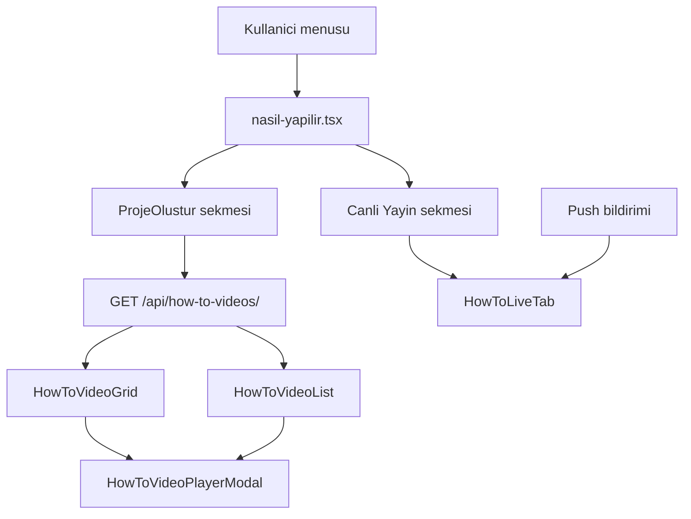

# ProjeOlustur Videoları

YouTube tutorial videolarının admin panelden yönetildiği, mobil uygulamada kategori gruplu grid/list ile gösterildiği modül.

## Ekran akışı (mobil)



- **ProjeOlustur sekmesi:** Aktif videolar API'den yüklenir; grid (3 sütun) veya list görünümü arasında geçiş `HowToScreenShell` menüsünden yapılır.
- **Canlı Yayın sekmesi:** Push veya deep link ile gelen oturum bilgisi `HowToLiveTab` içinde oynatılır; video listesi API'sinden bağımsızdır.

## Admin panel (pp33)

**URL:** `/accounts/admin/how-to-videos/`

Modal-only kart mimarisi — sayfa gövdesinde inline form yok.

| Bileşen | Açıklama |
|---------|----------|
| Toolbar | Yeni Video, Yeni Kategori |
| Kategori bölümü | Başlık + video kart grid'i; kalem → kategori düzenle modal |
| Video kartı | Thumbnail, başlık, sıra, aktif/pasif; kalem → video düzenle modal |
| videoModal | Ekle/düzenle: başlık, YouTube linki, açıklama, sıra, aktif, kategori seçimi |
| categoryModal | Ekle/düzenle: ad, sıra, aktif |

Kategorisiz videolar **Genel** bölümünde listelenir.

Sıra mantığı: `accounts/services/how_to_video_order.py` — yeni kayıt veya güncellemede `sort_order` shift edilir.

## Veri modeli (pp33)

| Model | Alanlar |
|-------|---------|
| `HowToVideoCategory` | `name`, `sort_order`, `is_active` |
| `HowToVideo` | `title`, `youtube_url`, `youtube_video_id`, `description`, `sort_order`, `is_active`, `category` (FK, null = Genel) |

Migration: `0186_howtovideocategory`

## Public API

**GET** `/api/how-to-videos/`

Yanıt:

```json
{
  "videos": [
    {
      "id": 1,
      "title": "...",
      "youtube_url": "...",
      "youtube_video_id": "...",
      "thumbnail_url": "...",
      "description": "",
      "sort_order": 1,
      "category": { "id": 2, "name": "Harita", "sort_order": 1 }
    }
  ]
}
```

- Yalnızca `is_active=true` videolar döner.
- Sıralama: `category.sort_order` → `category.id` → `video.sort_order` → `video.id`; kategorisiz videolar sonda.
- `category: null` → mobilde **Genel** grubu.

## Mobil bileşenler

| Dosya | Rol |
|-------|-----|
| `frontend/screens/routes/nasil-yapilir.tsx` | Sekmeler, video yükleme, grid/list seçimi |
| `frontend/components/how-to/HowToScreenShell.tsx` | Başlık, grid/list menüsü |
| `frontend/components/how-to/HowToVideoGrid.tsx` | 3 sütun grid + kategori başlık satırları |
| `frontend/components/how-to/HowToVideoList.tsx` | Liste + kategori başlık satırları |
| `frontend/components/how-to/HowToVideoPlayerModal.tsx` | Sayfa içi YouTube oynatıcı |
| `frontend/components/how-to/HowToLiveTab.tsx` | Canlı yayın sekmesi |
| `frontend/services/howToVideoService.ts` | API client |
| `frontend/utils/howToVideoGrouping.ts` | Kategori gruplama yardımcısı |

## Kategori gruplama (mobil)

`groupHowToVideosByCategory(videos)` API sırasını korur; ardışık aynı kategorideki videolar tek bölümde toplanır. Kategorisiz videolar `Genel` başlığı altında gösterilir.

Grid: bölüm başlığı tam genişlik satır; altında 3'lü video satırları.

## İlgili backend dosyaları (pp33)

- `accounts/models_how_to.py`
- `accounts/views/admin_how_to_views.py`
- `accounts/views/how_to_views.py`
- `accounts/templates/accounts/admin/how_to_videos.html`
- `accounts/services/how_to_video_order.py`
