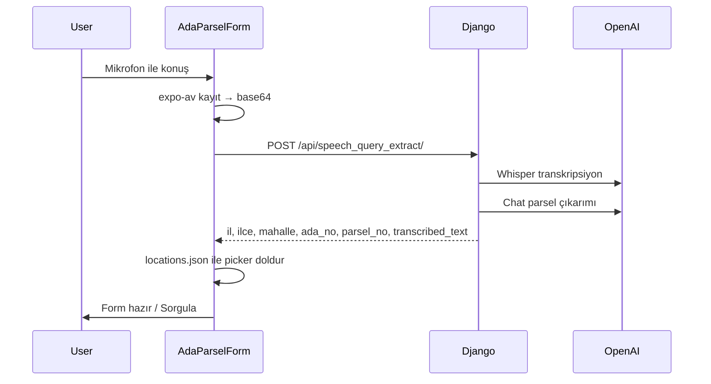

# Akıllı Sorgu (Mobil)

Mobil uygulamada **Ada Parsel Form** içindeki **Akıllı Sorgu** sekmesi; web ile aynı Django OpenAI API'lerini kullanır.

## Konum

- UI: [`frontend/app/components/AdaParselForm.tsx`](../../mobil_github/frontend/app/components/AdaParselForm.tsx) — `activeTab === 'akilli'`
- API base: [`frontend/config/api.ts`](../../mobil_github/frontend/config/api.ts) → `DJANGO_API_URL` / `EXPO_PUBLIC_API_URL`

## Hedef akış (2026-06-02)



## Endpoint'ler

| Kanal | Endpoint | Durum |
|-------|----------|-------|
| Ses (önerilen) | `POST /api/speech_query_extract/` | Backend hazır; mobil entegrasyon bekliyor |
| Metin | `POST /api/text_query_extract/` | Backend hazır |
| Resim | `POST /api/image_query_extract/` | Backend hazır; mobil image picker geçici kapalı |

### Ses isteği

```json
{
  "audio": "<base64>",
  "mimeType": "audio/m4a"
}
```

iOS: `audio/m4a`, Android: `audio/mp4` (kayıt formatına göre).

### Ses yanıtı

Web metin endpoint'i ile uyumlu alanlar + `transcribed_text`.

DB doğrulaması sonrası **Proparcel Id** alanları (mobil picker `Id` ile eşleştir):

| Alan | Açıklama |
|------|----------|
| `city_id` | İl Proparcel `Id` |
| `town_id` | İlçe Proparcel `Id` |
| `quarter_id` | Mahalle Proparcel `Id` |
| `tkgm_value` | Mahalle TKGM kodu (`mahalleTkgmValue`) |
| `proparcel_value` | Harita Proparcel_value |

**Mobil:** İsim fuzzy eşleştirme yerine `city_id`, `town_id`, `quarter_id` ile picker seçin; parsel sorgusu için `tkgm_value`.

## Eski / kaldırılacak

| Eski | Yeni |
|------|------|
| FastAPI `:8001` / `POST /api/speech-to-text` | Django `POST /api/speech_query_extract/` |
| Google Cloud Speech-to-Text | OpenAI Whisper |
| İki adım: speech → text_query | Tek adım: `speech_query_extract` |

## Form doldurma (fallback)

Id alanları yoksa `il`, `ilce`, `mahalle` isimleri `locations.json` içinde fuzzy eşleştirilir. **Tercih edilen yol id alanlarıdır.**

## Ortam

```env
EXPO_PUBLIC_API_URL=https://www.proparcel.com
EXPO_PUBLIC_DJANGO_API_URL=https://www.proparcel.com
```

Yerel: `http://127.0.0.1:8000` + `adb reverse tcp:8000 tcp:8000`

## İlgili dokümanlar

- Kanonik backend: [`docs/backend/smart_query.md`](../../../docs/backend/smart_query.md)
- Web UX: [`docs/frontend/ocr_query.md`](../../../docs/frontend/ocr_query.md)
- Ada/Parsel form: [`ada_parsel_form.md`](ada_parsel_form.md)
- Değişiklik: [`docs/changes/2026-06-02-smart-query-openai.md`](../../../docs/changes/2026-06-02-smart-query-openai.md)
