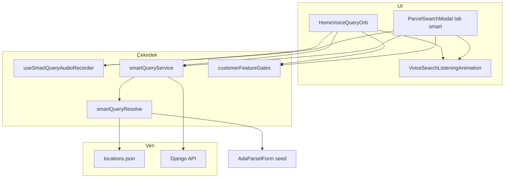
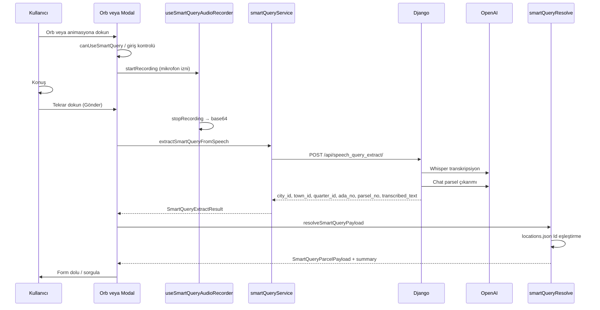

# Akıllı Sorgu (Mobil)

Mobil uygulamada kullanıcı **ses**, **metin** veya **görsel** ile parsel bilgisi verir; Django OpenAI API'leri metni çözümler, il/ilçe/mahalle/ada/parsel alanları çıkarılır ve Ada-Parsel sorgu formu doldurulur.

**Üst modül:** [Akıllı Ses](../modules/akilli_ses/modul_overview.md) — ortak ses altyapısı; parsel ses kanalı [sesli_sorgu_referans.md](../modules/akilli_ses/sesli_sorgu_referans.md).

## Özellik / görev

- Sesli komut: ana harita orb'u veya Ada-Parsel modalındaki Akıllı Sorgu sekmesi
- Metin ve görsel kanalları: yalnızca `ParcelSearchModal` Akıllı Sorgu sekmesi
- Backend: web ile aynı Django endpoint'leri (`POST /api/*_query_extract/`)
- Konum eşleştirme: API'den gelen `city_id`, `town_id`, `quarter_id` ile `locations.json` (tercih edilen); isim fuzzy fallback

## Dosya haritası



| Dosya | Rol |
|-------|-----|
| `frontend/components/app/HomeVoiceQueryOrb.tsx` | Ana harita ses orb'u (Konuş → Gönder) |
| `frontend/components/ParcelSearchModal.tsx` | Ada-Parsel sheet; `smart` sekmesi (ses + metin + görsel) |
| `frontend/components/app/VoiceSearchListeningAnimation.tsx` | idle / listening / processing animasyonu |
| `frontend/src/hooks/useSmartQueryAudioRecorder.ts` | expo-av kayıt, metering, base64 |
| `frontend/services/smartQueryService.ts` | Django API çağrıları, JWT, 403 yakalama |
| `frontend/src/utils/smartQueryResolve.ts` | API yanıtı → forma seed |
| `frontend/src/types/smartQuery.ts` | `SmartQueryExtractResult` tipi |
| `frontend/src/utils/customerFeatureGates.ts` | Giriş + abonelik kapısı |
| `frontend/src/utils/voiceQueryDebugLog.ts` | Cihazda JSON Lines debug günlüğü |
| `frontend/screens/routes/index.tsx` | Orb yerleşimi, `handleHomeVoiceQueryResolved` |
| `frontend/config/api.ts` | `DJANGO_API_URL` / `EXPO_PUBLIC_API_URL` |

## Giriş noktaları

### 1. Ana harita ses orb'u

- Bileşen: `HomeVoiceQueryOrb`
- Konum: `index.tsx` — harita alt katmanı (`homeVoiceOrbLayer`, safe area + 62px)
- Akış: ses → API → `smartQueryPayloadToFormSeed` → Ada-Parsel modal `parcel` sekmesi açılır, form dolu gelir
- Orb doğrudan parsel sorgusu çalıştırmaz; form seed üretir

### 2. Ada-Parsel modal — Akıllı Sorgu sekmesi

- Bileşen: `ParcelSearchModal`, `TabKey = 'smart'`
- Ses, metin ve görsel kanalları bu sekmede
- Sonuç: aynı `resolveSmartQueryPayload` → `AdaParselForm` seed

## Sesli sorgu akışı



### Ses kaydı (mobil)

- Kütüphane: `expo-av` (`RecordingOptionsPresets.HIGH_QUALITY`, metering açık)
- Dosya okuma: `react-native-fs` → base64
- MIME: iOS `audio/m4a`, Android kayıt uzantısına göre (`audio/mp4`, `audio/3gpp` vb.)
- İzin: `ensureMicrophonePermission` (`devicePermissions.ts`)
- UI durumları: `idle` → `listening` → `processing`

## API endpoint'leri

| Kanal | Endpoint | Mobil fonksiyon |
|-------|----------|-----------------|
| Ses | `POST /api/speech_query_extract/` | `extractSmartQueryFromSpeech` |
| Metin | `POST /api/text_query_extract/` | `extractSmartQueryFromText` |
| Görsel | `POST /api/image_query_extract/` | `extractSmartQueryFromImage` |

### Ses isteği

```json
{
  "audio": "<base64>",
  "mimeType": "audio/m4a"
}
```

### Yanıt alanları (özet)

| Alan | Açıklama |
|------|----------|
| `ok`, `error`, `engine` | İşlem durumu |
| `transcribed_text` | Whisper çıktısı (ses kanalı) |
| `il`, `ilce`, `mahalle`, `ada_no`, `parsel_no` | Çıkarılan metin alanları |
| `city_id`, `town_id`, `quarter_id` | Proparcel Id (picker eşleştirme) |
| `tkgm_value`, `proparcel_value` | Mahalle kodları |

Mobil picker **Id ile eşleştirir**; isim fuzzy yalnızca API id göndermediğinde (`resolveByNameFallback`).

### Kimlik doğrulama

- `Authorization: Bearer <access_token>`
- 401 → token refresh (`authService.refreshToken`) → tekrar dene
- Token yok → giriş uyarısı

## Erişim kontrolü (abonelik)

Kaynak: `GET /api/profile/read/` → `data.features.smart_query`

| `customer_type` | Davranış |
|-----------------|----------|
| `basic` | Sekme görünür, pasif; upgrade mesajı |
| `business`, `silver`, `gold`, `premium`, `vip`, `vip_limited` | Tam erişim |

Yardımcılar: `canUseSmartQuery`, `promptSmartQueryUpgrade`, `promptSmartQueryLogin`

API 403:

```json
{
  "error": "feature_locked",
  "feature": "smart_query",
  "message": "Bu özellik abonelik paketine dahildir."
}
```

Detay: [`customer_type_feature_gates_mobile.md`](customer_type_feature_gates_mobile.md)

## Form seed dönüşümü

`resolveSmartQueryPayload` başarılı olunca `smartQueryPayloadToFormSeed` üretir:

- `il`, `ilce`, `mahalle`, `ada`, `parsel`
- `il_id`, `ilce_id`, `mahalle_id`, `mahalle_tkgm_value`, `mahalle_proparcel_value`

**Ada boş:** Parsel varken `ada_no` boşsa resolve `"0"` kabul eder (TKGM köy/ada-yok). Boş ada yüzünden `resolve_failed` yazılmaz.

Bu seed `AdaParselForm` veya `SidebarSavedQuery` formatına aktarılır.

## Debug günlüğü

- Dosya: `{DocumentDirectory}/voice-query-debug.log` (JSON Lines, max ~512 KB)
- Kaynaklar: `orb`, `modal`, `recorder`, `api`
- Olaylar: kayıt başlat/durdur, API istek/yanıt, ağ hatası
- Modül: `frontend/src/utils/voiceQueryDebugLog.ts`

## Ortam

```env
EXPO_PUBLIC_API_URL=https://www.proparcel.com
EXPO_PUBLIC_DJANGO_API_URL=https://www.proparcel.com
```

Yerel geliştirme: `http://127.0.0.1:8000` + `adb reverse tcp:8000 tcp:8000`

## Kaldırılan eski sistem

| Eski | Güncel |
|------|--------|
| FastAPI `:8001` / `POST /api/speech-to-text` | Django `POST /api/speech_query_extract/` |
| Google Cloud Speech-to-Text | OpenAI Whisper |
| İki adım: speech → text_query | Tek adım: `speech_query_extract` |
| `AdaParselForm` içinde `activeTab === 'akilli'` | `ParcelSearchModal` `smart` sekmesi + ana harita orb |

## Test kontrol listesi

1. Giriş yapmadan orb → giriş uyarısı
2. `basic` hesap → sekme pasif, API 403 mesajı
3. Yetkili hesap → kayıt, gönder, form dolu
4. Kısa/boş kayıt → kullanıcı mesajı, API çağrılmaz
5. Mikrofon reddi → `permissionHint` metni
6. `quarter_id` eşleşmez → locations güncelleme / online lookup hata mesajı

## İlgili dokümanlar

- [`ada_parsel_form.md`](ada_parsel_form.md) — form alanları ve hiyerarşik seçim
- [`customer_type_feature_gates_mobile.md`](customer_type_feature_gates_mobile.md) — abonelik kapıları
- [`../api/konum_verisi_ve_endpointleri.md`](../api/konum_verisi_ve_endpointleri.md) — il/ilçe/mahalle veri kaynağı
- Backend (pp33 repo): `docs/backend/smart_query.md`
- Akıllı Ses modülü: [`docs/modules/akilli_ses/modul_overview.md`](../modules/akilli_ses/modul_overview.md)
