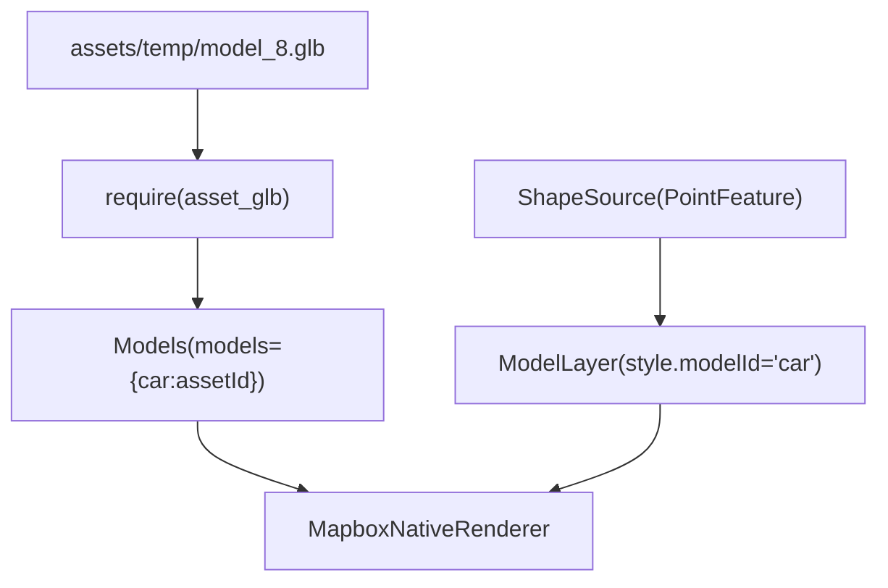

# Test ModelLayer (Bundle Asset GLB) — Başarılı 3D Model Doğrulama Yöntemi

## Amaç

Bu doküman, mobil uygulamada **3D model çiziminin** (Mapbox native pipeline) gerçekten çalıştığını **en temel** şekilde doğrulayan yöntemi tanımlar:

- `@rnmapbox/maps` **`Models` + `ModelLayer`**
- Model kaynağı olarak **bundle asset**: `require(".../model_8.glb")`

Bu yaklaşımda:
- `file://` URI
- indirme / cache / izinler
- ngrok / backend erişimi

tamamen devre dışıdır. Yani model bu ekranda görünüyorsa, sorun “ModelLayer çizimi” değil **file/cache/remote** tarafındadır.

## Kapsam / Ne Zaman Kullanılır?

- “Haritada yeşil nokta var ama 3D model görünmüyor” gibi durumlarda,
- `Models` / `ModelLayer` entegrasyonunun *temel olarak* çalışıp çalışmadığını ayırmak için.

## İlgili Dosyalar

- Test ekranı: `frontend/screens/routes/test_model_layer_asset.tsx`
- Navigasyon kayıtları:
  - `frontend/App.tsx` (Stack screen)
  - `frontend/screens/routes/index.tsx` (Hamburger menü item)
  - `frontend/src/hooks/useNavigation.ts` (route type)
- Metro asset config: `frontend/metro.config.js` (assetExts içinde `glb`, `gltf`)

## Kurulum (ZORUNLU)

### 1) GLB dosyasını bundle asset olarak ekle

Model dosyasını şu konuma koy:

- `frontend/assets/temp/model_8.glb`

Notlar:
- `require()` statik olduğu için dosya yoksa Metro **bundle aşamasında hata verir** (normal).
- Dosya değiştiyse Metro cache reset + native rebuild gerekebilir.

### 2) Metro `.glb/.gltf` uzantılarını asset olarak tanımalı

Bu projede zaten ekli olmalı:

- `frontend/metro.config.js` → `assetExts` içinde `glb`, `gltf`

## Kullanım / Test Adımları

1. Uygulamada hamburger menüden **“Test Model (Asset)”** ekranını aç.
2. Harita üzerinde:
   - Uydu (satellite) style açık olmalı.
   - Terrain (DEM) açık olmalı.
3. Kırmızı referans noktasında 3D modelin görünmesini bekle.

## Harita Ayarı (Uydu + Terrain)

Test ekranı şu kombinasyonu kullanır:

- `styleURL = "mapbox://styles/mapbox/satellite-streets-v12"`
- `RasterDemSource(url="mapbox://mapbox.mapbox-terrain-dem-v1")`
- `Terrain(exaggeration=1.4)`

## Veri Akışı (ModelLayer Pipeline)



Kritik noktalar:
- `Models` içindeki key ile `ModelLayer` `modelId` **aynı olmalı** (bu testte: `car`).
- Kamera `pitch > 0` iken 3D algısı daha net; testte `pitch=60`.

## Başarı Kriteri

- Kırmızı referans noktasında **3D model görünüyorsa**: `Models + ModelLayer` temel pipeline **başarılı**.
- Bu durumda “model görünmüyor” sorunu büyük ihtimalle:
  - `file://` erişimi / URI formatı,
  - cache anahtarı / modelId eşleşmesi,
  - Android izinleri / path çözümleme,
  - uzak URL erişimi
  tarafındadır.

## Strateji: “Listeden seç → indir → kalıcı sakla → ModelLayer ile kullan” (file:// sorununa takılmadan)

Amaç: Mapbox’a **asla ham path / content:// / cache path** vermeden, her zaman şu hattı zorlamak:

- Kullanıcı modeli seçer
- Model **app-specific kalıcı klasöre** indirilir (cache değil)
- Dosya adı **ASCII + deterministic** olur (Türkçe karakter yok)
- Mapbox’a verilen değer **mutlaka `file:///...`** formatına normalize edilir
- İndirme sonrası **dosya var mı + boyut kontrolü** yapılır (0 byte/bozuk ise yeniden indir)

### Kritik not (Models registry formatı)

`@rnmapbox/maps` `Models` bileşeni **`models` prop’unda** şunu bekler:

- `{ [modelId]: string | number }`
  - **string**: `"file:///..."` veya `"https://..."`
  - **number**: `require(".../asset.glb")` sonucu (bundle asset)

Yani indirilen modeller için doğru registry örneği:

- ✅ `models={{ cam_agaci: "file:///data/user/0/.../cam_agaci.glb" }}`
- ❌ `models={{ cam_agaci: { uri: "file://..." } }}`

### Kalıcı indirme: DB `model_id` ile isimlendir (önerilen)

Bu projede 3D model editöründe model listesi **veritabanından** gelir ve indirme URL’i de DB’den öğrenilir.

Bu nedenle cihazda kalıcı kaydederken:

- **Dosya adını** URL’den türetmek yerine, doğrudan DB’deki **`model_id`** alanını kullan.
- Önerilen isim: `model_<model_id>.glb`  
  - Örn: `model_8.glb`

Bu sayede:
- modelId eşleşmesi deterministik olur
- aynı model birden fazla URL ile gelse bile tek dosyada konsolide edilir
- “Türkçe karakter / URL encode” riskleri biter

Bu projede Expo yok; bu nedenle aşağıdaki yaklaşım **native** çalışır:

- Dosya yaz/oku: `react-native-fs`
- Index (modelId → fileUri): `@react-native-async-storage/async-storage`

Özet algoritma:
- `MODELS_DIR = <DocumentDir>/pp_models_store_v1/`
- `stableFileNameFromUrl(url)` ile **ASCII + deterministic** dosya adı üret
- İndir → **dosya var mı + size** doğrula → `file:///...` normalize et → index’e yaz

#### ModelStore.ts (native)

```typescript
import RNFS from "react-native-fs";
import AsyncStorage from "@react-native-async-storage/async-storage";

const MODELS_DIR = `${RNFS.DocumentDirectoryPath}/pp_models_store_v1`;
const INDEX_KEY = "pp_models_index_v1";
const MIN_BYTES = 1024; // 404 HTML vb. yakalamak için alt limit

export type ModelIndex = Record<
  string,
  {
    url: string;
    fileUri: string; // daima file:///... formatında
    bytes: number;
    updatedAt: number;
  }
>;

export function toFileUri(pathOrUri: string): string {
  if (!pathOrUri) return pathOrUri;
  if (pathOrUri.startsWith("file://")) return pathOrUri;
  if (pathOrUri.startsWith("content://")) {
    throw new Error("content:// URI Mapbox'a verilemez. Önce MODELS_DIR içine kopyalanmalı.");
  }
  if (pathOrUri.startsWith("/")) return `file://${pathOrUri}`;
  return pathOrUri;
}

function asciiSlug(input: string): string {
  return String(input)
    .toLowerCase()
    .replace(/[^a-z0-9]+/g, "_")
    .replace(/^_+|_+$/g, "")
    .slice(0, 48);
}

// Harici dependency olmadan küçük deterministic hash (djb2)
function smallHash(input: string): string {
  let h = 5381;
  for (let i = 0; i < input.length; i++) h = ((h << 5) + h) ^ input.charCodeAt(i);
  // unsigned hex
  return (h >>> 0).toString(16).padStart(8, "0");
}

function fileNameFromModelId(modelIdDb: number): string {
  // model_id: DB unique id
  return `model_${String(modelIdDb)}.glb`;
}

async function ensureDir() {
  const exists = await RNFS.exists(MODELS_DIR);
  if (!exists) await RNFS.mkdir(MODELS_DIR);
}

export async function loadIndex(): Promise<ModelIndex> {
  const raw = await AsyncStorage.getItem(INDEX_KEY);
  return raw ? (JSON.parse(raw) as ModelIndex) : {};
}

async function saveIndex(index: ModelIndex) {
  await AsyncStorage.setItem(INDEX_KEY, JSON.stringify(index));
}

export async function ensureModelDownloaded(modelId: string, url: string, modelIdDb: number): Promise<string> {
  await ensureDir();
  const index = await loadIndex();

  const existing = index[modelId];
  if (existing?.fileUri) {
    const p = existing.fileUri.replace(/^file:\/\//, "");
    const stat = await RNFS.stat(p).catch(() => null);
    if (stat?.isFile() && Number(stat.size) >= MIN_BYTES) return existing.fileUri;
  }

  const filename = fileNameFromModelId(modelIdDb);
  const targetPath = `${MODELS_DIR}/${filename}`; // RNFS path (file:// değil)

  // Bozuk/yarım dosya kalmışsa temizle
  const prev = await RNFS.exists(targetPath);
  if (prev) await RNFS.unlink(targetPath).catch(() => null);

  const r = await RNFS.downloadFile({ fromUrl: url, toFile: targetPath }).promise;
  if (r.statusCode && r.statusCode >= 400) {
    throw new Error(`Download failed. HTTP ${r.statusCode}`);
  }

  const stat = await RNFS.stat(targetPath).catch(() => null);
  const size = Number(stat?.size || 0);
  if (!stat?.isFile() || size < MIN_BYTES) {
    throw new Error(`Download corrupted. size=${size}`);
  }

  const fileUri = toFileUri(targetPath);
  index[modelId] = { url, fileUri, bytes: size, updatedAt: Date.now() };
  await saveIndex(index);
  return fileUri;
}

// Mapbox.Models için: { [modelId]: string }
export async function buildModelsRegistry(): Promise<Record<string, string>> {
  const index = await loadIndex();
  const out: Record<string, string> = {};
  for (const modelId of Object.keys(index)) out[modelId] = index[modelId].fileUri;
  return out;
}
```

### Neden bu yaklaşım “file://” riskini azaltır?

- Cache yerine kalıcı klasör: OS “cache eviction” yapmaz.
- Dosya adı ASCII: path encode/locale sürprizleri yok.
- `file:///...` normalize: Mapbox’a her seferinde tek format gider.
- Boyut doğrulama: 404 HTML/yarım dosya “indirildi sanıldı” durumları yakalanır.

### Sınır: Mapbox SDK local file’ı hiç açmıyorsa

Bu strateji **URI/indirilen dosya kalitesi** kaynaklı problemlerin çoğunu bitirir; ancak bazı cihaz/SDK kombinasyonlarında ModelLayer local file (`file://`) okumayı güvenilir yapmıyorsa, “tam garanti” için iki alternatif kalır:

- **Bundle asset** (`require(...)`) — bu dokümandaki test yöntemi
- **HTTPS üzerinden yerel serve/intercept** (Mapbox’a `https://...` verip içerde local dosyayı serve etmek)

## Sorun Giderme

### Model görünmüyor

- `modelScale` çok küçük olabilir → test ekranında ölçek büyüt (örn: `[200,200,200]`).
- Kamera `pitch=0` ile dene (perspektif etkisini elemek için).
- Harita token doğru set edildi mi? (`config/mapbox`).
- Metro cache + native build temizliği:
  - Metro: `--reset-cache`
  - Android: `./gradlew clean` + yeniden build

### Metro “dosya yok” hatası

- `assets/temp/model_8.glb` gerçekten var mı?
- Dosya adı birebir aynı mı? (`model_8.glb`)

## Sınırlamalar / Notlar

- Bu yöntem **production** için değil, “çiziyor mu?” doğrulaması içindir.
- GLB bundle’a girdiği için **APK/IPA boyutunu artırır**.
- Modeli değiştirmek için **yeniden build** gerekir.

