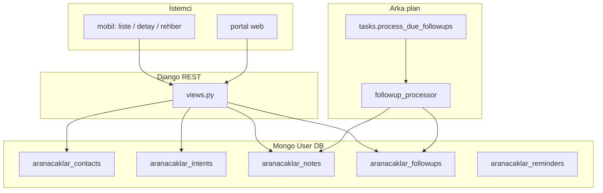

# Aranacaklar Modülü

Danışmanın rehberden veya elle eklediği kişileri, arama talebini (intent), notları ve periyodik arama takibini yönetir. Veri **MongoDB kullanıcı veritabanı** (`get_user_db`) üzerinde tutulur; kullanıcı kimliği sayısal `user_id` ile ayrılır. Proje genelindeki Mongo-first kimlik kuralı için bkz. repo kökü `architecture.md`.

## Kapsam

| Katman | Konum |
|--------|--------|
| Django uygulaması | `aranacaklar/` (kök) |
| REST API | `accounts/urls_api.py` altında `aranacaklar/...` path’leri |
| Mobil istemci | `frontend/screens/routes/aranacaklar*.tsx`, `services/aranacaklarService.ts`, `src/utils/aranacaklarIntentCategory.ts` |
| Portal (web) | `accounts/urls_portal.py` — sayfa adı `portal_aranacaklar` |

## Veri modeli (Mongo koleksiyonları)

Tüm koleksiyonlar kullanıcı DB’sinde; dokümanlar `user_id` ve `contact_id` ile ilişkilidir.

| Koleksiyon | Amaç |
|------------|------|
| `aranacaklar_contacts` | Kişi: `contact_id`, isim, telefon (`phone_e164` tekil indeks), `source`, arşiv |
| `aranacaklar_intents` | Talep: ana/alt kategori, `listing_type`, m² ve fiyat aralığı, isteğe bağlı il/ilçe/mahalle id listeleri |
| `aranacaklar_notes` | Kronolojik notlar |
| `aranacaklar_followups` | Aktif takip: `interval_months`, `next_due_at`, `last_called_at` |
| `aranacaklar_reminders` | Hatırlatma kuyruğu (Celery / bildirim ile ilişkili) |

## Mimari özet (hiyerarşi)

## Backend bileşenleri

- **`aranacaklar/views.py`** — Kimlik doğrulamalı API view’ları: liste/oluşturma, detay/silme, intent upsert, not ekleme, takip ayarlama, “arandı” işareti, portal filtre parametreleri.
- **`aranacaklar/selectors.py`** — `build_contact_list` / `build_contact_detail`: contact + intent + followup birleştirme; liste için sorgu parametrelerine göre filtre.
- **`aranacaklar/serializers.py`** — Girdi doğrulama.
- **`aranacaklar/mongo/*.py`** — Koleksiyon erişimi (`contact_store`, `intent_store`, `note_store`, `followup_store`, `reminder_store`).
- **`aranacaklar/services/filter_resolver.py`** — Intent’ten portal vitrin sorgusu için parametre üretimi (kanonik yaprak id, kök eşleme).
- **`aranacaklar/services/followup_processor.py`** — Vadesi gelen takipleri işler; bildirim tetikler.
- **`aranacaklar/services/notification_service.py`** — Push / uygulama içi bildirim.
- **`aranacaklar/tasks.py`** — `process_due_followups` Celery görevi (Beat ile periyodik çalıştırılır).
- **`aranacaklar/management/commands/process_aranacaklar_followups.py`** — Senkron veya operasyonel fallback için komut.

## REST API (özet)

Temel önek: `/api/aranacaklar/` (tam path ortamda `accounts` API kökü ile birleşir).

| Metot | Path | Görev |
|-------|------|--------|
| GET | `aranacaklar/` | Liste (`ContactFilterSerializer` query ile filtre) |
| POST | `aranacaklar/` | Yeni kişi (duplicate `phone_e164` → 409) |
| GET | `aranacaklar/<contact_id>/` | Detay: contact, intent, notes, followup |
| DELETE | `aranacaklar/<contact_id>/` | Arşivle |
| POST | `aranacaklar/<contact_id>/intent/` | Talep kaydet/güncelle |
| POST | `aranacaklar/<contact_id>/notes/` | Not ekle |
| POST | `aranacaklar/<contact_id>/followup/` | Takip aralığı (ay) |
| POST | `aranacaklar/<contact_id>/followup/called/` | Arandı + sonraki tarih |
| GET | `aranacaklar/<contact_id>/portal-filters/` | Portal hızlı filtre JSON |

## Girdiler ve akış (mobil detay)

1. **Talep formu** — Ana kategori (`arsa`, `tarla`, `yapi`, `ticari`), alt kategori ilan ağacından yaprak id, satılık/kiralık, m² ve fiyat alanları.
2. **Kaydet** — Önce intent API; başarılıysa not alanı doluysa not API; tek başarı mesajı; not alanı temizlenir.
3. **Takip** — 1/3/6/12 ay veya “Arandı” ile `followup` güncellenir.

## Mobil dosyalar

| Dosya | Rol |
|-------|-----|
| `screens/routes/aranacaklar.tsx` | Liste kartı (sol: kişi + talep özeti; sağ: işlem rozeti, Ara, Detay) |
| `screens/routes/aranacaklar-detail.tsx` | Form, notlar, takip chip’leri |
| `screens/routes/aranacaklar-picker.tsx` | Rehberden içe aktarma |
| `components/app/AranacaklarScreenShell.tsx` | Ortak kabuk |
| `services/aranacaklarService.ts` | `authJsonFetch` ile API çağrıları |
| `src/utils/aranacaklarIntentCategory.ts` | `INTENT_MAIN_TO_ROOT_ID`, `normalizeIntentLeafId`, `formatIntentCardParts` (liste özeti) |

## Çıktılar

- Liste satırı: `contact`, isteğe bağlı `intent`, `followup` özeti.
- Detay: tam `contact`, `intent`, `notes[]`, `followup`.
- Intent kaydı: güncellenmiş intent dokümanı (store dönüşü).

## Diğer modüllere veri akışı

- **Portal vitrin** — `portal-filters` yanıtı veya mobil tarafta üretilen sorgu parametreleri ile `QueryDfaSnapshot` / liste endpoint’leri; PG katmanı yalnızca ilan verisi için (ProParcel mimarisindeki zorunlu PG kullanımı ayrı dokümanda).
- **Bildirimler** — Vadesi gelen takip için `notification_service` → kullanıcıya hatırlatma.

## Güncelleme notu

Bu dosya, `docs/architecture.md` içindeki dokümantasyon kurallarına uygun olarak modülün güncel tek kaynağıdır; davranış değişince burası ve gerekiyorsa ilgili kod yorumları güncellenir.
