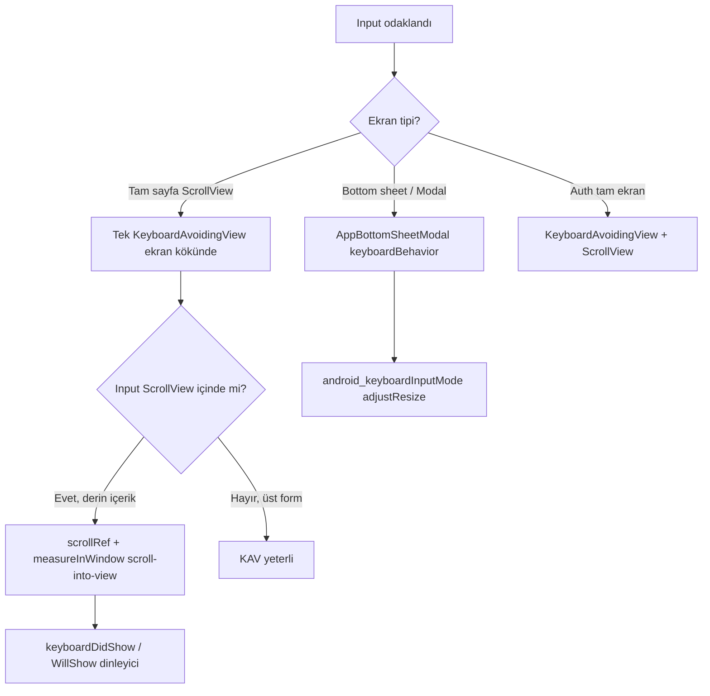

# Mobil klavye ve input alanı gösterim rehberi

Bu doküman, ProParcel React Native mobil uygulamasında (`frontend`) klavye açıldığında `TextInput` alanlarının görünür kalması ve ekranda istenmeyen boşluk/renk şeridi oluşmaması için **tek ve güncel** uygulama standardını tanımlar.

**Hedef kitle:** Geliştiriciler ve yapay zeka asistanları. Klavye veya form input düzenlemesi yapılacaksa **önce bu dosya okunur**; ardından ilgili ekran/bileşen kodu incelenir.

---

## Amaç

| Sorun | Beklenen davranış |
|--------|-------------------|
| Input klavyenin altında kalıyor | Odaklanan alan klavye üstünde görünür |
| Klavye kapanınca lacivert / header renginde boş şerit | Sayfa arka planı tutarlı (`pageBg`), ekstra padding yok |
| Çift `KeyboardAvoidingView` | Tek ekran sarmalayıcı; içeride yalnızca scroll-into-view |

---

## Mimari özet (iki katman)



1. **Ekran katmanı:** En fazla **bir** `KeyboardAvoidingView` (veya bottom sheet’in kendi klavye ayarı).
2. **Input katmanı:** İç içe `ScrollView` / sekme değişimi varsa, odaklanan alan için **programatik scroll** (`measureLayout` + `measureInWindow` + klavye yüksekliği).

Bu iki katman **aynı anda padding/offset ile çift kaydırma yapmamalıdır.

---

## 0. Merkezi klavye API (zorunlu kullanım)

Yeni veya güncellenen ekranlarda doğrudan `KeyboardAvoidingView` kopyalamak yerine aşağıdaki modül ve bileşenler kullanılır.

| Parça | Yol | Ne zaman |
|--------|-----|----------|
| Sabitler / yardımcılar | `src/keyboard/` (`constants`, `useKeyboardHeight`, `useScrollInputIntoView`) | Tüm klavye mantığı |
| Tam sayfa scroll | `components/app/KeyboardAwareScrollScreen.tsx` | Auth, profil, detay, formlar |
| FlatList / sabit gövde | `components/app/KeyboardAwareBody.tsx` | Arama + liste (rehber picker) |
| Tam ekran modal | `components/app/KeyboardAwareModal.tsx` | Metin düzenleme, uzman detay modal |
| Bottom sheet form | `AppBottomSheetModal` + **`keyboardForm`** | Sheet içinde `TextInput` |
| AdaParselForm | `embedded` / `inBottomSheet` prop | Gömülü veya sheet; dış KAV yok |

**Sheet:** `keyboardForm` → `KEYBOARD_SHEET_MODAL_PROPS` (`adjustResize`, `interactive`) otomatik birleşir.

**Scroll-into-view:** `useScrollInputIntoView({ scrollRef, inputWrapRef, onBeforeFocus })` — referans: `PortalDfaTableCard`.

---

## 1. Tam sayfa detay ekranı (referans: Son 30 Gün detay)

**Dosya:** `frontend/screens/routes/son-30-gun-detay.tsx`

### 1.1 `KeyboardAwareScrollScreen`

- `SafeAreaView` → sabit header → **`KeyboardAwareScrollScreen`** (`headerHeight={56}`, `backgroundColor={pageBg}`).
- İçeride tek scroll; `ref={scrollRef}` scroll-into-view için.

```tsx
<KeyboardAwareScrollScreen
  ref={scrollRef}
  headerHeight={56}
  backgroundColor={COLORS.pageBg}
  contentContainerStyle={[s.scrollContent, { paddingBottom: insets.bottom + 24 }]}
>
  {/* içerik */}
</KeyboardAwareScrollScreen>
```

`keyboardAvoidingFill` arka planı **`COLORS.pageBg`** olmalı; `headerBg` kullanılmaz (klavye animasyonunda lacivert şerit oluşur).

### 1.2 Yasak: `keyboardInset` / çift padding

- ScrollView `contentContainerStyle` içine klavye yüksekliği kadar **ekstra `paddingBottom`** (`keyboardInset`) **eklenmez** — bu, `KeyboardAvoidingView` ile birlikte çift boşluk yaratır.
- Aynı ekranda ikinci bir `KeyboardAvoidingView` (ör. yalnızca DFA kartı için) **konmaz**.

### 1.3 ScrollView props (zorunlu)

| Prop | Değer | Neden |
|------|--------|--------|
| `keyboardShouldPersistTaps` | `"handled"` | Klavye açıkken butonlara basılabilir |
| `keyboardDismissMode` | `"on-drag"` | Kaydırınca klavye kapanır |
| `nestedScrollEnabled` | `true` | Yatay sekme şeridi vb. |

---

## 2. ScrollView içindeki input (referans: DFA mahalle birim fiyatı)

**Dosya:** `frontend/components/app/PortalDfaTableCard.tsx`

DFA sekmesi üst ekranın `ScrollView`’i içinde; `KeyboardAvoidingView` tek başına alanı yeterince yukarı taşımayabilir. Bu yüzden **scroll-into-view** kullanılır.

### 2.1 Gerekli prop’lar

Ebeveyn ekran şunları geçirir:

| Prop | Tip | Görev |
|------|-----|--------|
| `scrollRef` | `RefObject<ScrollView>` | Ana dikey scroll |
| `onBeforeMahalleInputFocus` | `() => void` | Odak öncesi sekme `overview`’a alınır |

**Ebeveyn örnek:** `son-30-gun-detay.tsx` → `ensureOverviewTabForDfaInput` + `scrollRef={scrollRef}`.

### 2.2 Scroll-into-view algoritması

1. Input sarmalayıcısına `ref` (`mahalleOrtWrapRef`).
2. `Keyboard.addListener` — iOS: `keyboardWillShow`, Android: `keyboardDidShow`; yükseklik `keyboardHeightRef`.
3. `onFocus` → `measureLayout` (scroll içerik koordinatı) + `measureInWindow` (klavye üstü çizgisi).
4. `scroll.scrollTo({ y: targetY })` — input alt kenarı klavyenin ~20px üstünde kalacak şekilde.

Gecikmeli tekrar çağrı: sekme değişimi veya klavye animasyonu için `setTimeout(..., 50/220/280)` (mevcut referans değerleri).

### 2.3 Yeni kart/bileşen eklerken

`useScrollInputIntoView` kullan; `PortalDfaTableCard` referans implementasyondur.

---

## 3. Bottom sheet ve modal formlar

### 3.1 Parsel sorgu sheet

**Dosyalar:** `components/ParcelSearchModal.tsx`, `components/AdaParselForm.tsx`

- `AppBottomSheetModal` → **`keyboardForm`** (manuel `modalProps` yerine)
- İçerik: `BottomSheetScrollView` + `keyboardShouldPersistTaps="handled"`
- Form: `AdaParselForm` kendi `KeyboardAvoidingView` + picker modal’ında `keyboardHeight` padding kullanır (`embedded` prop ile gömülü ekranlarda `flex:1` kaldırılır).

**Not:** Sheet zaten klavyeyi yönetir; üst ekranda aynı anda ikinci KAV açmayın.

### 3.2 Metin düzenleme modalı

**Dosya:** `components/app/TextBoxEditModal.tsx`

- Tam ekran `Modal` + `KeyboardAvoidingView` (`padding` yalnızca iOS).
- Kısa form; ayrı scroll-into-view gerekmez.

### 3.3 Auth ekranları

**Dosyalar:** `screens/routes/(auth)/login.tsx`, `register.tsx`, `forgot-password.tsx`

- **`KeyboardAwareScrollScreen`** (`behaviorContext="auth"`, `headerHeight` = sabit üst bar).
- `contentContainerStyle` içinde **`justifyContent: "center"` kullanılmaz** — klavye açılınca alan kaydırılamaz.
- Giriş (`login.tsx`): e-posta/telefon ve şifre için `scrollRef` + `useScrollInputIntoView` (şifre klavye üstünde kalır).

---

## 4. Gömülü form (ScrollView içinde AdaParselForm)

**Dosya:** `screens/routes/ai-drone-video-info.tsx` (örnek)

- `ScrollView` + `keyboardShouldPersistTaps="handled"`.
- `AdaParselForm` **`embedded`** prop ile (iç `flex:1` kaldırılır).
- Bu ekranda **ek** `KeyboardAvoidingView` gerekmez; kısa form ve tek scroll yeterlidir.
- Uzun formlarda iOS’ta hafif sorun olursa yalnızca o ekrana tek KAV eklenir; sheet + KAV birlikte kullanılmaz.

---

## 5. Yapılmaması gerekenler

| ❌ Yapma | ✅ Bunun yerine |
|---------|----------------|
| Ekranda 2+ `KeyboardAvoidingView` | Tek KAV veya sheet klavye API’si |
| KAV + `paddingBottom: keyboardHeight` | Yalnızca biri |
| KAV arka planı `headerBg` | `pageBg` veya kart beyazı |
| Android’de `behavior="padding"` (detay ekran) | `undefined` |
| Input odakta sadece KAV, scroll ref yok (uzun ScrollView içi) | `scroll-into-view` |
| `keyboardInset` state ile content padding | Kaldırıldı; geri ekleme |

---

## 6. Yeni ekran / özellik checklist’i

Klavye veya input eklendiğinde:

1. [ ] Bu rehber okundu.
2. [ ] Ekran tipi seçildi: tam sayfa / sheet / modal / gömülü form.
3. [ ] En fazla bir klavye sarmalayıcısı var.
4. [ ] `keyboardShouldPersistTaps="handled"` (scroll veya sheet scroll).
5. [ ] Uzun scroll içindeki input → `scrollRef` + focus scroll (gerekirse `onBeforeFocus` ile sekme).
6. [ ] Android KAV `behavior` gözden geçirildi.
7. [ ] Klavye açık/kapalı: input görünür, altında lacivert şerit yok.
8. [ ] İlgili bileşen dokümanı veya bu rehber güncellendi (kalıcı davranış değiştiyse).

---

## 7. Manuel test

| Adım | Beklenen |
|------|----------|
| Son 30 Gün detay → DFA → Mahalle Ort. input odak | Input klavye üstünde; Hesapla/refresh tıklanabilir |
| Klavye kapat (drag dismiss) | Ekstra boşluk kalmaz |
| Başka sekmeden DFA’ya geçip input odak | Önce overview; scroll doğru |
| Parsel sorgu bottom sheet → ada/parsel | Alanlar görünür, picker modal çalışır |
| AI Drone bilgi → parsel form | Scroll + input kullanılabilir |

---

## 8. İlgili dosyalar (güncel referans)

| Dosya | Rol |
|-------|-----|
| `src/keyboard/*` | Merkezi hook ve sabitler |
| `components/app/KeyboardAwareScrollScreen.tsx` | Tam sayfa scroll |
| `components/app/KeyboardAwareBody.tsx` | FlatList + arama |
| `components/app/KeyboardAwareModal.tsx` | Modal formlar |
| `components/app/AppBottomSheetModal.tsx` | `keyboardForm` |
| `screens/routes/son-30-gun-detay.tsx` | Scroll ekran + sheet formlar |
| `components/app/PortalDfaTableCard.tsx` | `useScrollInputIntoView` |
| `components/ParcelSearchModal.tsx` | `keyboardForm` + `inBottomSheet` form |
| `components/AdaParselForm.tsx` | `embedded` / `inBottomSheet` |
| `components/app/TextBoxEditModal.tsx` | `KeyboardAwareModal` |
| `screens/routes/(auth)/*.tsx` | `KeyboardAwareScrollScreen` |

---

## 9. Dokümantasyon güncelleme

- Davranış değişirse **bu dosyadaki ilgili bölüm doğrudan güncellenir** (diff/“eski-yeni” bölümü eklenmez).
- `docs/architecture.md` ve `docs/architecture.md` içindeki referans satırı güncel kalır.
