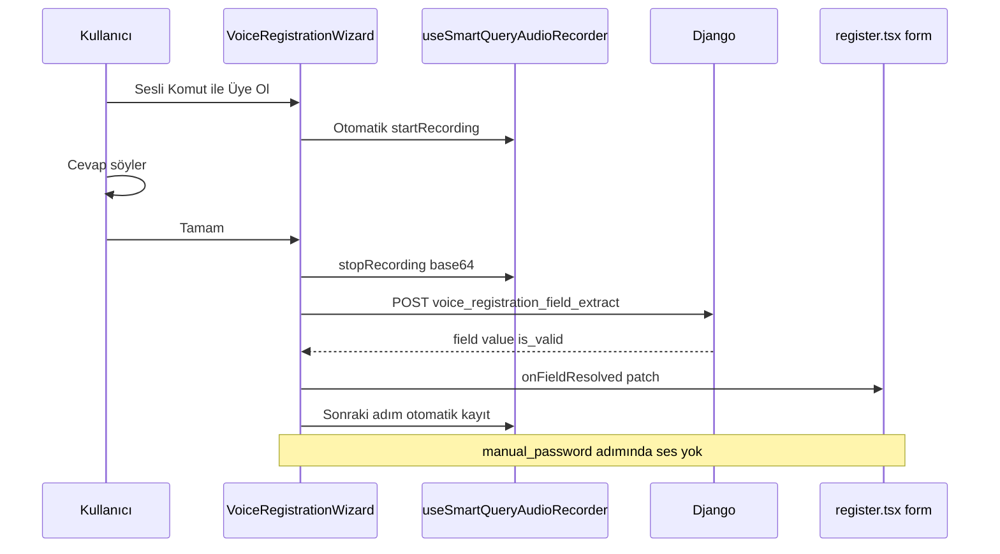

# Sesli Üyelik

Kayıt ekranında **Sesli Komut ile Üye Ol** ile açılan sihirbaz; üyelik formu alanlarını sesle doldurur. Şifre, KVKK, mezuniyet, uzmanlık ve OTP manuel kalır.

## Ön koşullar

| Üyelik | Wizard öncesi |
|--------|---------------|
| Bireysel | `member_type = individual` seçili |
| Kurumsal | `corporate_type` (emlak/spk/lihkab) tab ile seçili |
| Danışman | Firma seçili veya sesli `consultant_company` adımı |

## Akış

## Wizard durumları

`idle` → `listening` → `processing` → (başarı) sonraki adım | (hata) `error` → yeniden `listening`

`completed`: `manual_password` sonrası wizard kapanır; şifre manuel.

## Dinamik adımlar

`voiceRegistrationSteps.buildVoiceRegistrationSteps(ctx)` — `member_type` + `corporate_type` (danışmanda firmanın tipi).

### Ortak ses adımları

| Sıra | field | Ekran |
|------|-------|-------|
| 1 | `full_name` | Adınızı ve soyadınızı söyleyin. |
| 2 | `phone` | Telefon numaranızı söyleyin. (bireysel opsiyonel) |
| 3 | `email` | E-posta adresinizi söyleyin… |

Danışman: `consultant_company` **email öncesi** (firma seçili değilse).

Kurumsal/danışman:

| field | Ekran |
|-------|-------|
| `location` | İl, ilçe ve mahalle bilginizi söyleyin. |
| `address_detail` | Sokak, cadde, kapı no, kat ve daire… |

Kurumsal ek:

| field | Not |
|-------|-----|
| `company_name` | Opsiyonel; helper: *Yetki belgeniz varsa ve firma değilseniz bu adımı geçin.* Geç → ad soyad fallback |
| `company_license_no` | Zorunlu |
| `spk_tc_no` | Yalnız SPK kurumsal |
| `office_no` | Yalnız LİHKAB kurumsal |

Danışman SPK parent: `consultant_license_no`

Son: `manual_password` — ses yok; şifre elle.

## Form patch

| API field | register state |
|-----------|----------------|
| `full_name` | `firstName`, `lastName` |
| `phone` | `phoneNumber` |
| `email` | `email` |
| `location` | `corporateAddress` (city/district/quarter) |
| `address_detail` | `corporateAddress.streetAndNumber` |
| `company_name` | `companyName` |
| `company_license_no` | `companyLicenseNo` |
| `spk_tc_no` | `spkTcNo` |
| `office_no` | `officeNo` |
| `consultant_license_no` | `consultantLicenseNo` |
| `consultant_company` | `selectedCompany` |

## Firma türü stratejisi

Kurumsal tab seçimi wizard öncesi zorunlu. SPK seçilince mezuniyet otomatik Lisans; LİHKAB mezuniyeti temizler. Danışman firma tipini seçilen firmadan devralır.

Detay: plan dokümanı *Firma türü stratejisi* bölümü; test: [test_matrisi.md](./test_matrisi.md).

## Manuel kalan adımlar

- Mezuniyet (SPK kurumsal/danışman zorunlu)
- Profil fotoğrafı / kurumsal logo
- Uzmanlık bölgeleri (LİHKAB hariç)
- Şifre, şifre tekrar, KVKK
- SMS OTP (telefon girildiyse)

## Dosyalar

- `frontend/components/auth/VoiceRegistrationWizard.tsx`
- `frontend/src/hooks/useVoiceRegistrationWizard.ts`
- `frontend/services/voiceRegistrationService.ts`
- `frontend/src/utils/voiceRegistrationSteps.ts`
- `frontend/src/utils/voiceRegistrationResolve.ts`
- `frontend/src/utils/voiceRegistrationValidators.ts`
- `frontend/src/types/voiceRegistration.ts`

## API

[api_voice_registration.md](./api_voice_registration.md)
