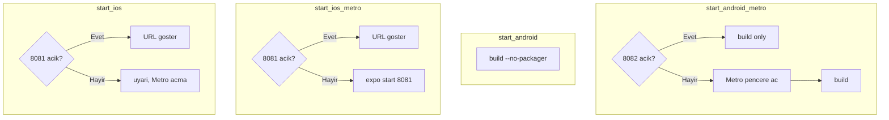

# Metro port akisi (Windows)

Giriş dosyaları `frontend/` kökünde:

| Dosya | Metro | Build / baglanti |
|-------|-------|------------------|
| `start_android.bat` | Baslatmaz | `run-android --no-packager` |
| `start_android_metro.bat` | Kapaliysa ac (8082) | + build |
| `start_ios.bat` | Baslatmaz | URL / odaklan |
| `start_ios_metro.bat` | Kapaliysa ac (8081) | expo start |

Port tanimi: `scripts/metro-ports.ps1` (iOS 8081, Android 8082).
