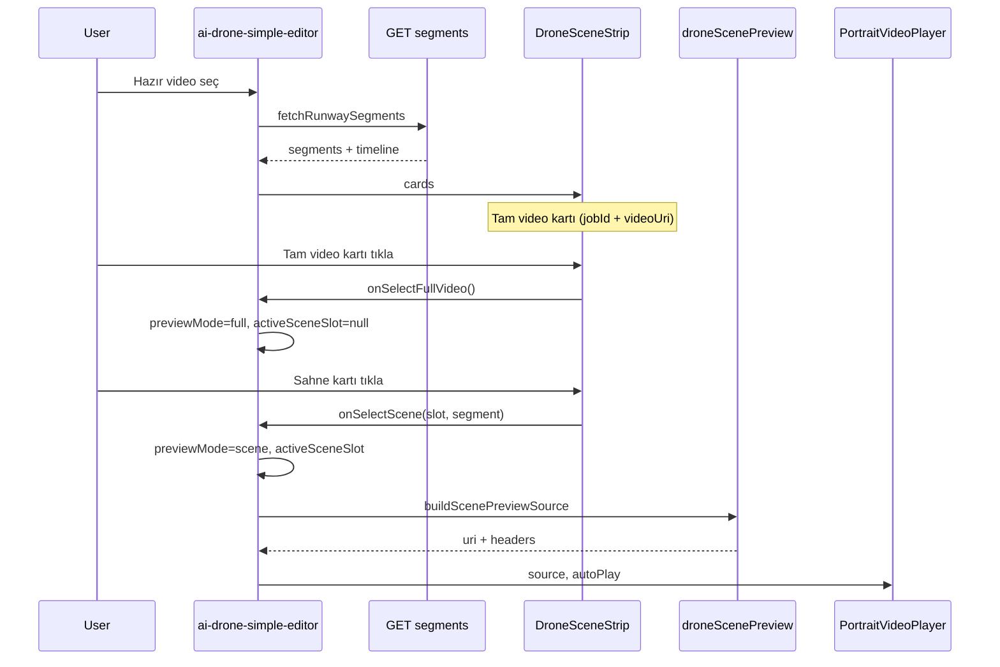

# Drone sahne strip — uçtan uca akış

Tek kaynak gerçek: Pratik Video editöründe sahne kartları (frame strip), önizleme ve silme davranışı.

## Terimler

| Terim | Anlam |
|-------|--------|
| **slot** | Diskteki runway segment numarası (1…N). Backend `reference_XX.jpg` / segment mp4 ile eşleşir. |
| **strip sırası** | Kartların yatay dizilimi; birleştirme bu sırayı kullanır (slot numarası sırası değil). |
| **timeline entry** | `meta.segment_timeline` öğesi: `id`, `slot`, `label`. Sıra ve silme kimliği. |
| **strip kart** | `DroneSceneStrip` içindeki gerçek, placeholder veya **Tam video** kartı. |
| **placeholderFree** | Paket içi ücretsiz hak (`included - used`) ile eşleşen aktif boş slot. |
| **Tam video kartı** | Strip'in en başındaki kalıcı kart; birleşik/hazır videoya dönüş (`fullVideo: true`). Allowance dışı. |
| **previewMode** | `none` \| `full` (birleşik video) \| `scene` (tek segment). |

## Dosya haritası

| Dosya | Rol |
|-------|-----|
| `screens/routes/ai-drone-simple-editor.tsx` | Job state, önizleme player, handler'lar |
| `components/ai-drone-simple/DroneSceneStrip.tsx` | Kart UI, birleştir/yeni sahne |
| `components/ai-drone-simple/DroneSceneThumbnail.tsx` | Kart thumbnail (paused video veya ref JPG) |
| `services/droneSceneService.ts` | Segments GET, timeline PATCH, silme bootstrap |
| `services/droneSceneTimeline.ts` | Strip sırası, reorder, merge timeline (saf) |
| `services/droneScenePreview.ts` | Sahne önizleme URL/source çözümleme |
| `services/aiDroneSimpleEditorService.ts` | Tam video önizleme URL (`resolveDroneRunwayPreviewVideoUrl`) |

## E2E akış

### Job seçimi

1. `hydrateAndSelectJob` → `refreshScenes` → `sceneSegments` / `sceneTimeline` dolar.
2. `resolveDroneRunwayPreviewVideoUrl` → `previewMode=full`, tam video üst alanda.
3. `sceneStripCards`: `jobId && videoUri` varken `{ fullVideo: true }` prepend — strip başında **Tam video** kartı.

### Tam video kartı (strip başına dönüş)

Görünürlük: **`Boolean(jobId && videoUri)`** — hazır video seçimi veya birleştir sonrası.

1. Editör `buildSceneStripCards` sonucuna `{ slot: null, fullVideo: true }` ekler (allowance dışı; toplam scroll ≈ 1 + 5).
2. `DroneSceneStrip`: film ikonu veya `videoUri` paused thumbnail; etiket **Tam video**; sil / birleştir checkbox yok.
3. Tıklama → `handleSelectFullVideo`: `previewMode=full`, `activeSceneSlot=null`, sahne önizleme state temizlenir.
4. Active kenarlık: `fullVideoActive={previewMode === "full"}`.

Web referans: `DroneEditorApp.jsx` → `pp-de-full-video-card` / `handleRestoreFullVideoPlayback`.

### Boş kart (placeholder)

1. İlk üretim **4 sahne**; paket içi yedek **1 hak** (`DRONE_SCENE_INITIAL_COUNT=4`, toplam 5).
2. Aktif boş kart: yeşil **Ücretsiz sahne ekle** (paket hakkı) veya nötr **Sahne ekle** (IAP sonrası); tap → `onNewScene`.
3. Pasif boş kart: soluk `+`, tap yok.
4. Oturum limiti: `maxAppendCountForSession(rights, mevcutSahne)` = min(2, remaining, 5−sahne).
5. Üretim sırasında `placeholderProgress` spinner gösterilir.

### Kart tıklama (sahne önizleme)

1. `DroneSceneStrip` → `onSelectScene(slot, segment)`.
2. Editor: `setActiveSceneSlot`, `setPreviewMode("scene")`, `setSceneSegmentCacheBust`.
3. `buildScenePreviewSource({ jobId, slot, segment, authHeader, cacheBust })`:
   - Önce `segment.url` (absolute) + cache bust — web `handleSegmentPlay` ile aynı.
   - Yoksa `segmentFileUrl(jobId, slot, bust)`.
   - Remote URL ise `authHeader` eklenir.
   - Player hatasında: remote cache bust retry, ardından `resolveScenePreviewSourceAsync` (yerel indirme + `normalizeLocalMediaUri`).
4. `PortraitVideoPlayer` sahne modunda `autoPlay`, müzik kapalı.

### Ok ile sıralama (seçili sahne)

1. Sahne kartına tıkla → önizleme + mavi kenarlık (`activeSceneSlot`).
2. Strip başlığı sağ üstte **◀ ▶** ince oklar — seçili kartı bir adım sola/sağa kaydırır.
3. `DroneSceneStrip` → `onMoveActiveScene(-1 | 1)`.
4. Editör: `moveSceneTimelineByStep` + `updateSegmentTimeline` (finalize yok) → `refreshScenes`.
5. Etiketler S1…Sn yeniden numaralanır; ilk/son kartta ilgili ok disabled.
6. Optimistic UI yok — PATCH başarısızsa `refreshScenes` ile sunucu truth.

### Birleştirme (strip sırası)

1. Checkbox ile 2+ sahne seç → **Sahne birleştir**.
2. `buildMergeTimelineFromStripOrder` — seçili sahneler **strip sırasında** (slot sort yok).
3. `updateSegmentTimeline` + `finalizeSegmentTimeline(merge_timeline)` + poll → tam video.

### Silme (strip kalır, tek kart gider)

1. `deleteRunwaySceneEntry` — gerekirse timeline bootstrap, sonra entry.id ile PATCH.
2. `refreshScenes` — sunucu truth.
3. `showSceneStrip = Boolean(jobId)` — strip asla tamamen kaybolmaz.

## API sözleşmesi (pp33)

| Endpoint | Kullanım |
|----------|----------|
| `GET /api/drone-recording-runway/segments/?job_id=` | `segments[]`, `timeline[]`, `scene_rights` |
| `GET /api/drone-recording-runway/segment-file/{job_id}/{slot}/` | Segment mp4 (auth gerekli) |
| `PATCH /api/drone-recording-runway/segments/timeline/` | Timeline güncelle / sil (prev−next slot farkı dosya siler) |

Web referans (pp33 `DroneEditorApp.jsx`):

- Oynat: `handleSegmentPlay` — `entry.segment.url` + `?t=` cache bust.
- Sil: `handleSegmentDelete` — `timeline.filter(id !== entry.id)`.

## Bilinen tuzaklar

1. **Thumbnail Video dokunuşu** — Kart içindeki `react-native-video` `TouchableOpacity` onPress'i yutar. Çözüm: thumbnail'de `pointerEvents="none"`, sarmalayıcıda tıklama.
2. **file:// normalizasyonu** — Yerel path `/data/...` iken player HTTP sanmamalı. `normalizeLocalMediaUri` kullan.
3. **meta.segment_timeline boş** — Silme PATCH'i dosya silmez; önce bootstrap gerekir (`deleteRunwaySceneEntry`).
4. **Optimistic segment state** — Silme/refresh öncesi UI tahmini yapma; sunucu cevabını bekle.
5. **showSceneStrip** — `Boolean(jobId)`; `exists` segment sayısına bağlama (strip kaybolmasın).
6. **Birleştir slot sort** — `mergeSelectedSlots` strip sırasına göre birleştirilmeli; slot numarasına sort etme.

## Debug checklist

Sahne önizlemesi gelmiyorsa sırayla kontrol et:

- [ ] Kart tıklanınca mavi kenarlık (`activeSceneSlot`) görünüyor mu?
- [ ] `previewMode === "scene"` mi?
- [ ] `buildScenePreviewSource` dönen `uri` boş değil mi?
- [ ] Remote URL ise `authHeader.Authorization` var mı?
- [ ] Yerel fallback ise URI `file://` ile mi başlıyor?
- [ ] `segment.exists === true` ve slot doğru mu?

## Manuel test

| # | Adım | Beklenen |
|---|------|----------|
| 1 | Hazır video seç | Strip başında **Tam video** kartı |
| 2 | S1 tıkla → Tam video kartı tıkla | Segment → birleşik video |
| 3 | 2+ sahne birleştir | Birleştir bitince tam video kartı başta, önizleme full |
| 4 | Birleştir sonrası S2 tıkla → Tam video | Geri dönüş çalışır |
| 5 | Tam video kartında sil/birleştir UI yok | Yalnızca sahne kartlarında |
| 6 | S1 kartına tıkla (sahne) | Üstte segment oynar, sahne kartı mavi |
| 7 | Ortadaki sahneyi sil, kalan karta tıkla | Strip kalır, önizleme çalışır |
| 8 | Oturum kapalı | Crash yok, anlamlı boş/hata durumu |
| 9 | S2'ye tıkla → sağ ok | S2 bir sağa; etiketler S1,S2,S3 |
| 10 | İlk sahne + sol ok | Disabled |
| 11 | Son sahne + sağ ok | Disabled |
| 12 | Sıra değiştir → 2 sahne birleştir | Video strip sırasında |
| 13 | busy/merging sırasında oklar | Disabled |
| 14 | İlk üretim sonrası strip | 4 dolu + 1 yeşil ücretsiz boş kart |
| 15 | IAP ek_sahne_2 + 2 boş slot | Tek oturumda 2 sahne, sıralı placeholder progress |

## Güncelleme kuralı

Bu akışta kod değişince bu dosyayı aynı oturumda güncelle. Agent skill: `.cursor/skills/drone-scene-doc-first/SKILL.md`.
